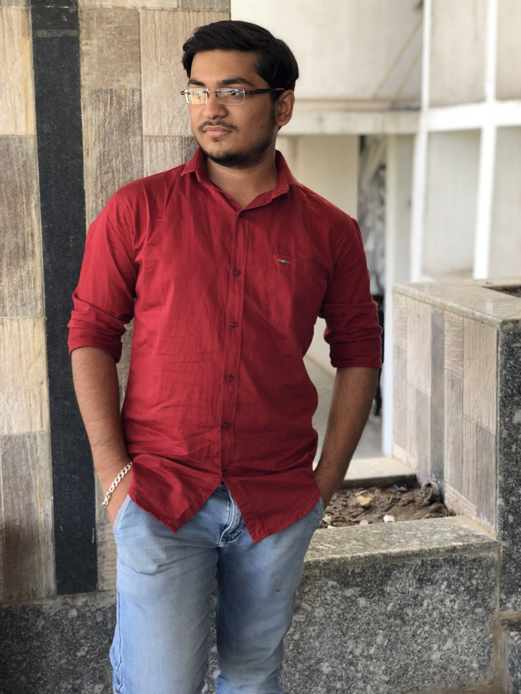

I am Dhruv Makwana from Ahmedabad, Gujarat, India currently pursuing a Bachelor's in Computer Engineering (B.E.) at LJ Institute of Engineering and Technology, final year. I'm a Machine Learning Enthusiast with a dedicated history of exploring and practicing different areas of ML, DL and other technologies in the software industry. Here I explain some research work and projects I have done. Have questions or suggestions? Feel free to ask me at dmakwana503@gmail.com

Thanks for reading!