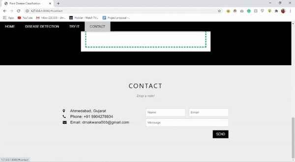

Crop diseases are a major threat to food security, but their rapid identification remains difficult in many parts of the world due to the lack of the necessary infrastructure. The combination of increasing global smartphone penetration and recent advances in computer vision made possible by deep learning has paved the way for disease diagnosis.

Every disease, pest, and deficiency leaves behind a specific pattern. We recognize these patterns. One photo is enough and you know what your plant is missing.

Entire code of this can be found [here](https://github.com/DhruvMakwana/crop-disease-detection)

## Demo of application

## Dataset
Here we have used the plant village dataset. The PlantVillage dataset consists of 61,486 healthy and unhealthy leaf images divided into 39 categories by species and disease.

Dataset can be found [here](https://data.mendeley.com/datasets/tywbtsjrjv/1)

The classes uses in dataset are:
<pre>
1. Apple_scab                                                     2. Apple_black_rot
3. Apple_cedar_apple_rust                                         4. Apple_healthy
5. Background_without_leaves                                      6. Blueberry_healthy
7. Cherry_powdery_mildew                                          8. Cherry_healthy
9. Corn_gray_leaf_spot                                            10. Corn_common_rust
11. Corn_northern_leaf_blight                                     12. Corn_healthy
13. Grape_black_rot                                               14. Grape_black_measles
15. Grape_leaf_blight                                             16. Grape_healthy
17. Orange_haunglongbing                                          18. Peach_bacterial_spot
19. Peach_healthy                                                 20. Pepper_bacterial_spot
21. Pepper_healthy                                                22. Potato_early_blight
23. Potato_healthy                                                24. Potato_late_blight
25. Raspberry_healthy                                             26. Soybean_healthy
27. Squash_powdery_mildew                                         28. Strawberry_healthy
29. Strawberry_leaf_scorch                                        30. Tomato_bacterial_spot
31. Tomato_early_blight                                           32. Tomato_healthy
33. Tomato_late_blight                                            34. Tomato_leaf_mold
35. Tomato_septoria_leaf_spot                                     36. Tomato_spider_mites_two-spotted_spider_mite
37. Tomato_target_spot                                            38. Tomato_mosaic_virus
39. Tomato_yellow_leaf_curl_virus
</pre>

There are two versions of dataset one without augmentation and other with augmentation where augmentation is performed with 6 different techniques (flipping, Gamma correction, noise injection, PCA color augmentation, rotation, and Scaling).

<pre>
Consider This file structure
-plantdisease
	-dataset
	-input
		-Apple_black_rot.jpg
		-Apple_cedar_apple_rust.jpg
		-Apple_healthy.jpg
		-Apple_scab.jpg
		-Background_without_leaves.jpg
		-Blueberry_healthy.jpg
	-models
		-rn.h5
	-src
		-dataset.py
		-train.py
		-predict.py
	-static
		-images
			-image_1.jpg
			-image_2.jpg
			-image_3.jpg
			-image_4.jpg
	-templates
		-index.html
		-result.html
	-upload
	-main.py
	-requirements.txt
</pre>

## Prepare Dataset

First, we need to download the dataset and place it under the dataset folder. For downloading dataset run `src/dataset.py` file. let's see what it does.

	# importing libraries
	import requests, zipfile, io

	"""
		Download images folder from given url, move it to dataset folder.
	"""

	# url for data without augmentation
	# url = "https://data.mendeley.com/datasets/tywbtsjrjv/1/files/d5652a28-c1d8-4b76-97f3-72fb80f94efc/Plant_leaf_diseases_dataset_without_augmentation.zip?dl=1"

	# url for data with augmentation
	url = "https://data.mendeley.com/datasets/tywbtsjrjv/1/files/b4e3a32f-c0bd-4060-81e9-6144231f2520/Plant_leaf_diseases_dataset_with_augmentation.zip?dl=1"
	response = requests.get(url)
	z = zipfile.ZipFile(io.BytesIO(response.content))
	z.extractall()

we are downloading a zip file from the given URL, unzipping it, and placing it in the dataset folder. Note that the current code is used data with augmentation. 

run `python dataset.py` command to run this file 

## Train Model

we are going to use ResNet152V2 model to train for 10 epochs with early stopping. open `src/train.py` file and import following code.

# importing libraries
from glob import glob
from keras.models import Model
from keras.preprocessing.image import ImageDataGenerator
from keras.layers import GlobalAveragePooling2D
from keras.layers.core import Dropout, Dense
from keras.applications import ResNet152V2
from keras.applications.resnet_v2 import preprocess_input
from keras.optimizers import Adam
import tensorflow as tf
s
Now setup directory path, and print number of total images,

	train_dir  = "../dataset/Plant_leave_diseases_dataset_with_augmentation"
	print("Number of Images are: {}".format(len(glob(train_dir + '/*/*'))))

Output of above code will be
	
	Number of images are: 61486

We require to perform some preprocessing for that we can use `keras.applications.resnet_v2.preprocess_input()` function. other than that we also need to split our data in training and testing. data should also be rescaled. For splitting, we have used 80-20 split for train and test. All of these things can be done within the ImageDataGenerator class. Note that we are using data that is already augmented so we are not performing any other kind of Augmentation in ImageDataGenerator class. We have used a batch size of 32 you can change as per your configuration.

	# data augmentation
	aug = ImageDataGenerator(preprocessing_function = preprocess_input,
	validation_split = 0.20,
	rescale = 1./255)  

	batch_size = 32
	training_set = aug.flow_from_directory(train_dir,
		target_size = (224, 224),
		batch_size = batch_size,
		class_mode = "categorical",
		subset = "training")
	test_set = aug.flow_from_directory(train_dir,
		target_size = (224, 224),
		batch_size = batch_size,
		class_mode = "categorical",
		subset = "validation")

Let's define architecture now. We are importing prebuild ResNet152V2 with imagenet weights with the input shape of (224, 224, 3). We are adding three layers GlobalAveragePooling2D layer, Dropout layer with a dropout rate of 0.25, and Dense layer with 39 nodes which is the number of classes we have. Make a trainable parameter to True as we are going to train the whole model and print model summary.

	# define architecture
	baseModel = ResNet152V2(weights = "imagenet", include_top = False, input_shape = (224, 224, 3))
	headModel = baseModel.output
	headModel = GlobalAveragePooling2D()(headModel)
	headModel = Dropout(0.25)(headModel)
	headModel = Dense(39, activation='sigmoid', name = "resnet152v2_dense")(headModel)

	model = Model(inputs = baseModel.input, outputs = headModel, name = "ResNet152V2")

	model.trainable = True
	print(model.summary())

Now we are defining the criteria to stop training. We will stop training if validation accuracy got reached 98% after the corresponding epoch completes. We are using Callback from tf.keras.callbacks to achieve this. Note that we are considering the result of validation accuracy after epoch ends.

	class myCallback(tf.keras.callbacks.Callback):
		def on_epoch_end(self, epoch, logs={}):
			if(logs.get('val_accuracy') > 0.97):
				print("\nReached 97% accuracy so cancelling training!")
				self.model.stop_training = True

	callbacks = myCallback()

Compile the model using Adam optimizer with a learning rate of 0.005 You can change this to see the difference. We are using categorical_crossentropy loss and accuracy as our matrics.

	# compile model
	model.compile(optimizer = Adam(learning_rate = 0.005), loss = 'categorical_crossentropy', metrics=['accuracy'])

Start training for 10 epochs with the training set and testing set. Use steps_per_epoch equal to training_set.samples//batch_size and validation steps to test_set.samples//batch_size. Don't forget to use callbacks we created for early stopping. 

	# start training
	H = model.fit_generator(training_set,
		steps_per_epoch = training_set.samples//batch_size,
		validation_data = test_set,
		epochs = 10,
		validation_steps = test_set.samples//batch_size,
		callbacks = [callbacks],
		verbose = 1) 

Result of above training is 

	Epoch 1/10
	3074/3074 [==============================] - 794s 258ms/step - loss: 0.7289 - accuracy: 0.7813 - val_loss: 0.5274 - val_accuracy: 0.8464
	Epoch 2/10
	3074/3074 [==============================] - 791s 257ms/step - loss: 0.2194 - accuracy: 0.9288 - val_loss: 0.2383 - val_accuracy: 0.9264
	Epoch 3/10
	3074/3074 [==============================] - 803s 261ms/step - loss: 0.1427 - accuracy: 0.9531 - val_loss: 0.1081 - val_accuracy: 0.9674
	Epoch 4/10
	3074/3074 [==============================] - 803s 261ms/step - loss: 0.1065 - accuracy: 0.9653 - val_loss: 0.1219 - val_accuracy: 0.9585
	Epoch 5/10
	3074/3074 [==============================] - 799s 260ms/step - loss: 0.0835 - accuracy: 0.9730 - val_loss: 0.1150 - val_accuracy: 0.9653
	Epoch 6/10
	3074/3074 [==============================] - ETA: 0s - loss: 0.0670 - accuracy: 0.9778
	Reached 97% accuracy so cancelling training!
	3074/3074 [==============================] - 793s 258ms/step - loss: 0.0670 - accuracy: 0.9778 - val_loss: 0.0773 - val_accuracy: 0.9769

Save the model in models directory after training completes. 
	
	# save the model to file
	model.save('../models/resnet152v2.h5')

run `python train.py` command to run this file.

## Test Model

Now, let's test the model by uploading a single picture and predicting its class. Open `src/predict.py` file and import following code.
	
	# importing libraries
	import numpy as np
	import keras
	from keras.preprocessing.image import img_to_array
	from keras.models import load_model
	from keras.preprocessing import image
	import cv2 

For predicting any image, we need an image path. So, assign URL of an image to image path variable and load model which we trained in train.py file.

	imagepath = "../input/Apple_black_rot.jpg"
	model = load_model("./models/rn.h5") 

The following dictionary is used to assign class with numbers in the same order as used in training. This will help in printing original class values instead of numbers. 

	 output_dict = {'Apple_scab': 0,
					'Apple_black_rot': 1,
                    'Apple_cedar_apple_rust': 2,
                    'Apple_healthy': 3,
                    'Background_without_leaves': 4,
                    'Blueberry_healthy': 5,
                    'Cherry_powdery_mildew': 6,
                    'Cherry_healthy': 7,
                    'Corn_gray_leaf_spot': 8,
                    'Corn_common_rust': 9,
                    'Corn_northern_leaf_blight': 10,
                    'Corn_healthy': 11,
                    'Grape_black_rot': 12,
                    'Grape_black_measles': 13,
                    'Grape_leaf_blight': 14,
                    'Grape_healthy': 15,
                    'Orange_haunglongbing': 16,
                    'Peach_bacterial_spot': 17,
                    'Peach_healthy': 18,
                    'Pepper_bacterial_spot': 19,
                    'Pepper_healthy': 20,
                    'Potato_early_blight': 21,
                    'Potato_healthy': 22,
                    'Potato_late_blight': 23,
                    'Raspberry_healthy': 24,
                    'Soybean_healthy': 25,
                    'Squash_powdery_mildew': 26,
                    'Strawberry_healthy': 27,
                    'Strawberry_leaf_scorch': 28,
                    'Tomato_bacterial_spot': 29,
                    'Tomato_early_blight': 30,
                    'Tomato_healthy': 31,
                    'Tomato_late_blight': 32,
                    'Tomato_leaf_mold': 33,
                    'Tomato_septoria_leaf_spot': 34,
                    'Tomato_spider_mites_two-spotted_spider_mite': 35,
                    'Tomato_target_spot': 36,
                    'Tomato_mosaic_virus': 37,
                    'Tomato_yellow_leaf_curl_virus':38}
     output_list = list(output_dict.keys())

Its time to load an image and predict its class. we are using the OpenCV library to read the image and resize it to (224, 224) size. we also need to convert image to an array and rescale it the same as we did in training. Then pass an image to model.predict method.
	
	print("loading image")
	img = cv2.imread(imagepath)
	img = cv2.resize(img, (224,224))
	img = image.img_to_array(img)
	img = np.expand_dims(img, axis=0)
	img = img/255	
	print("predicting output")
	prediction = model.predict(img)
	prediction_flatten = prediction.flatten()
	max_val_index = np.argmax(prediction_flatten)
	result = output_list[max_val_index]
	print(result)

Make a call to function build with image path if a call is made externally. To run this file execute `python predict.py` command. All set up now let's build flask application. We require 2 HTML files `index.html` for the main home page and `result.html` to show the result of the predicted class. We can combine tasks in a single file also. We need file uploader in index.html file which uploads the image and using main.py we will fetch that image and predict its class. Let's look at the file uploader code. 

	<form action="/result" method="post" enctype="multipart/form-data">
		
        

      		<button class="file-upload-btn" type="button" onclick="$('.file-upload-input').trigger( 'click' )">Add Image</button>
      		

        		<input class="file-upload-input" type='file' name="file"  onchange="readURL(this);" accept="image/*" />
        		

          			<h3>Drag and drop a file or select add Image</h3>
        		

      		

      		

        		
        		

          			<input class="file-upload-btn" type = "submit" value="Upload">
          			<button type="button" onclick="removeUpload()" class="remove-image">Remove Uploaded Image</button>
        		

      		

    	

    </form>

We are using form action to be "/result" so it transfers form data to '/result' URL. the method should be post and enctype="multipart/form-data" is required. The main focus of code is input class line here name variable is used in fetching time so don't change it from name="file". Next look at the contact us section, here we will take data from users and send it via the mail. 

	<form action="/contact" method="POST">
		

			

				<input class="w3-input w3-border" type="text" placeholder="Name" required name="Name">
            

            

            	<input class="w3-input w3-border" type="text" placeholder="Email" required name="Email">
            

        

        <input class="w3-input w3-border" type="text" placeholder="Message" required name="Message">
        <button class="w3-button w3-black w3-section w3-right" type="submit">SEND</button>
    </form>

Its time to build the main.py file and code for fetching this image. open `main.py` and insert the following code.

	# importing libraries
	from flask import Flask, render_template, request
	from werkzeug.utils import secure_filename
	from flask_mail import Mail
	from src.predict import build
	import os

We have used flask_mail.Mail to implement contact us section where we are sending mail with the body of contact us. Next, Initialize the app and configure mail updates.
	
	app = Flask(__name__)
	app.config.update(
		MAIL_SERVER = 'smtp.gmail.com',
		MAIL_PORT = '465',
		MAIL_USE_SSL = True,
		MAIL_USERNAME = <you mail id through which mail will be sent>,
		MAIL_PASSWORD = <password of mail id> 
		)
	mail = Mail(app)

We need one Gmail access to send mail from that id. make sure you have enabled Less secure app access for that id so it can send mail via python. Now let's make a function to redirect to our index.html and result.html.

	@app.route('/')
	def home():
		return render_template('index.html')

	@app.route("/result" ,methods = ["GET", "POST"])
	def result():
		if request.method == 'POST':
			f = request.files.get('file')
			f.save(os.path.join("upload", secure_filename(f.filename)))
			filepath = os.path.join("upload", secure_filename(f.filename))
			result = build(filepath)
			st = "Your Predicted result is "
			result = st + str(result)
			print(result)
			return render_template("result.html", result=result)
		return render_template("index.html")

here, we are fetching image file with request.files.get command where the file is the variable we have used in index.html as name property. To use this image for prediction, we need to save it in a folder and take it from there, to do so we have used an upload folder where the image is saved and taken when needed. After that image is passed to build function which takes image path as input and returns its predicted class. We need this result to be printed on the result page so we are sending this variable to the result page in render_template. Note that here we have used two render template commands to make sure we will send the result page only if we get post request. Following code handles this result variable in result.html file.

	

    	

      		<h2 class="w3-wide w3-center">Result</h2>
      		
<i>result of your uploaded image</i>
 
      		
{{result}}
      			
Want to try again? Click <a href="/#try">here</a>

      		

    	

    

Focus on the {{result}}, this takes result from main.py and print it here. 
The last section is to handle contact us section requests and send a mail with the body of contact us. We have three fields in contact us section name, email, and message. we will fetch these three field by its name property used in index.html and use mail.send_message to send this message via email. 

	@app.route("/contact",methods=['GET','POST'])
	def contact():
		if (request.method == 'POST'):
        	name = request.form.get('Name')
        	email = request.form.get('Email')
       		message = request.form.get('Message')
        	mail.send_message('New message from ' + email,
        				sender=<sender email id>,
                      	recipients=<reciepient email id>,
                      	body=message + " from " + name
                      	)
    	return render_template('index.html')

here replace the sender email id with the email id you used above in the configuration section and recipient email id with your personal email id where you will receive all emails. Now finally to run this file on a specific host and port include this code at last.

	if __name__ == "__main__":
		app.run(host = "127.0.0.1", port = 8080, debug = True)

To run this, file execute `python main.py` command. Congratulations, you have made a plant disease classification flask app.
