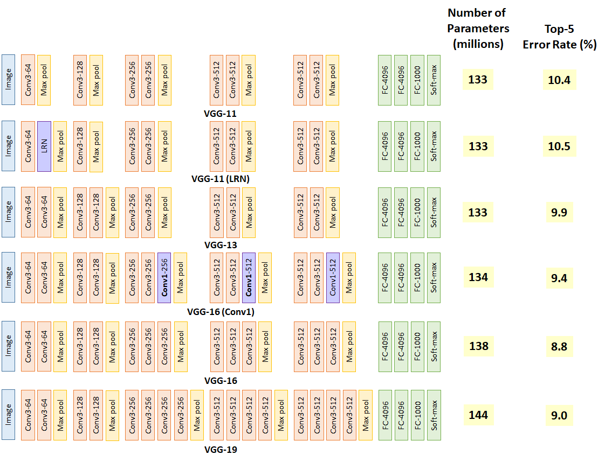
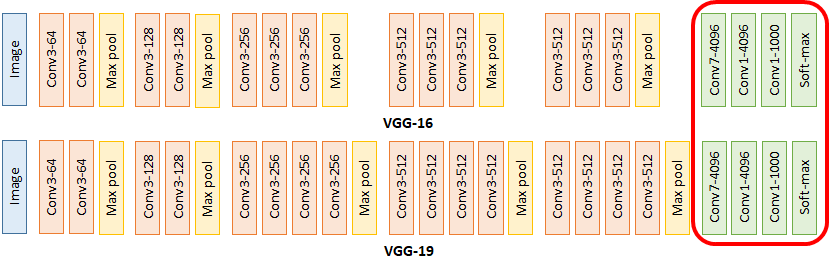
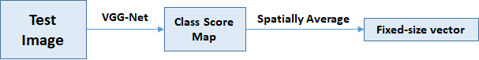

## OVERVIEW

With ConvNets becoming more of a commodity in the computer vision field, a number of attempts have been made to improve the original architecture of Krizhevsky et al. (2012) in a bid to achieve better accuracy. In this paper, they address an important aspect of ConvNet architecture design – its depth. To this end, authors fix other parameters of the architecture, and steadily increase the depth of the network by adding more convolutional layers, which is feasible due to the use of very small (3 × 3) convolution filters in all layers. As a result, they come up with significantly more accurate ConvNet architectures, which not only achieve the state-of-the-art accuracy on ILSVRC classification and localisation tasks, but are also applicable to other image recognition datasets.

## CONVNET CONFIGURATIONS

All ConvNet layer configurations are designed using the same principles. First ConvNet Architecture, then configuration and then discussion.

### ARCHITECTURE

During training, the input to ConvNets is a fixed-size 224 × 224 RGB image. The only preprocessing done is subtracting the mean RGB value, computed on the training set, from each pixel. The image is passed through a stack of convolutional (conv.) layers, with filters of a very small receptive field: 3 × 3. (Note that In one of the configurations authors also utilise 1 × 1 convolution filters, which can be seen as a linear transformation of the input channels). The convolution stride is fixed to 1 pixel. The padding is also 1 pixel for 3 × 3 conv. Layers. Pooling is carried out by five max-pooling layers, which follow some of the conv. layers. Max-pooling is performed over a 2 × 2 pixel window, with stride 2.

A stack of convolutional layers is followed by three Fully-Connected (FC) layers: the first two have 4096 channels each, the third contains 1000 channels (one for each class). The final layer is the soft-max layer.

All hidden layers are equipped with the rectification non-linearity. (Note: None of their Networks(except for one) contain Local Response Normalisation (LRN) normalisation, such normalisation does not improve the performance.

### CONFIGURATIONS

The ConvNet configurations, evaluated in below Table. Names of the networks are given from A to E. All configurations follow the generic design and differ only in the depth (A: 11 layers; B: 13 layers; C: 16 layers; D: 16 layers; E: 19 layers).

The width of the network is small starting from 64 and increasing by a factor of 2 until it reaches 512.

In the above image VGG-11 is network A, VGG-11 (LRN) is network A-LRN, VGG-13 is network B, VGG-16 (conv1) is network C, VGG-16 is network D, VGG-19 is network E.
1. VGG-11 has a 10.4% error rate
2. VGG-11 (LRN) has a 10.5% error rate, is the one with additional local response normalization (LRN) layer. The error rate does not improve, which means LRN is notuseful.
3. VGG-13 obtains 9.9% error rate, which means increasing depth helps in accuracy.
4. VGG-16 (Conv1) has a 9.4% error rate, which means the additional three 1×1 conv layers help the classification accuracy. 1×1 conv actually helps to increase non-linearity of the decision function as stated in paper.
5. VGG-16 has 8.8% error rate, which means increasing depth is still useful.
6. VGG-19 has a 9.0% error rate which means the deep learning network is NOT improving by increasing the depth. Thus, authors stop adding layers.

<pre>
Parameters of VGG16(not counting biases)
INPUT: 		[224x224x3] 			params: 0
CONV3-64: 	[224x224x64] 			params: (3*3*3)*64 = 1,728
CONV3-64: 	[224x224x64] 			params: (3*3*64)*64 = 36,864
POOL2: 		[112x112x64] 			params: 0
CONV3-128: 	[112x112x128] 			params: (3*3*64)*128 = 73,728
CONV3-128: 	[112x112x128] 			params: (3*3*128)*128 = 147,456
POOL2: 		[56x56x128] 			params: 0
CONV3-256: 	[56x56x256] 			params: (3*3*128)*256 = 294,912
CONV3-256: 	[56x56x256] 			params: (3*3*256)*256 = 589,824
CONV3-256: 	[56x56x256] 			params: (3*3*256)*256 = 589,824
POOL2: 		[28x28x256]	 			params: 0
CONV3-512: 	[28x28x512] 			params: (3*3*256)*512 = 1,179,648
CONV3-512: 	[28x28x512] 			params: (3*3*512)*512 = 2,359,296
CONV3-512: 	[28x28x512] 			params: (3*3*512)*512 = 2,359,296
POOL2: 		[14x14x512] 			params: 0
CONV3-512: 	[14x14x512] 			params: (3*3*512)*512 = 2,359,296
CONV3-512: 	[14x14x512] 			params: (3*3*512)*512 = 2,359,296
CONV3-512: 	[14x14x512] 			params: (3*3*512)*512 = 2,359,296
POOL2: 		[7x7x512] 				params: 0
FC: 		[1x1x4096] 				params: 7*7*512*4096 = 102,760,448
FC: 		[1x1x4096] 				params: 4096*4096 = 16,777,216
FC: 		[1x1x1000] 				params: 4096*1000 = 4,096,000
									TOTAL: 138M parameters
</pre>

### Observation

**What can be gained by using, for instance, a stack of three 3×3 conv. layers instead of a single 7×7 layer?**​ First, if we incorporate three non-linear rectification layers instead of a single one, then it makes the decision function more discriminative. Second, the number of parameters are decreased. The incorporation of 1 × 1 conv. layers is a way to increase the nonlinearity of the decision function without affecting the receptive fields of the conv. layers. Thus, large-size filters such as 11×11 in AlexNet and 7×7 in ZFNet indeed are not needed.
1 layer of 11×11 filter, number of parameters = 11×11=121
5 layer of 3×3 filter, number of parameters = 3×3×5=45 
Number of parameters is reduced by 63%
1 layer of 7×7 filter, number of parameters = 7×7=49
3 layers of 3×3 filters, number of parameters = 3×3×3=27 
Number of parameters is reduced by 45%
By using 1 layer of 5×5 filter, number of parameters = 5×5=25 
By using 2 layers of 3×3 filters, number of parameters = 3×3+3×3=18 
Number of parameters is reduced by 28%
With fewer parameters to be learnt, it is better for faster convergence, and reduced overfitting problems.

## CLASSIFICATION FRAMEWORK

### TRAINING

The training is carried out by optimising the multinomial logistic regression using mini-batch gradient descent with momentum. The batch size was set to 256, momentum to 0.9. The training was regularised by weight decay (the L2 penalty multiplier set to 5 · 10−4 ) and dropout regularisation for the first two fully-connected layers (dropout ratio set to 0.5). The learning rate was initially set to 10​−2​ , and then decreased by a factor of 10 when the validation set accuracy stopped improving. In total, the learning rate was decreased 3 times, and the learning was stopped after 370K iterations (74 epochs).

For the initialization authors began with training the configuration network A(11 layers), shallow enough to be trained with random initialisation. Then, when training deeper architectures, they initialised the first four convolutional layers and the last three fully connected layers with the layers of net A (the intermediate layers were initialised randomly). Learning rate is not decreased for the pre-initialised layers, allowing them to change during learning. For random initialisation (where applicable), they sampled the weights from a normal distribution with the zero mean and 10​−2​ variance. The biases were initialised with zero.

To obtain the fixed-size 224×224 ConvNet input images, they were randomly cropped from rescaled training images. To further augment the training set, the crops underwent random horizontal flipping and random RGB colour shift.

### Training image size

Let S be the smallest side of a training image. In this paper there are two approaches for setting the training scale S. The first is to fix S, which corresponds to single-scale training. In paper experiments, authors evaluated models trained at two fixed scales: S = 256 and S =
384. Given a ConvNet configuration, they first trained the network using S = 256. To speed-up training of the S = 384 network, it was initialised with the weights pre-trained with S = 256, and the learning rate was 10​−3​.

The second approach to setting S is multi-scale training, where each training image is individually rescaled by randomly sampling S from a certain range [Smin, Smax], in paper authors have used Smin = 256 and Smax = 512. Since objects in images can be of different size, it is beneficial to take this into account during training. For speed reasons, training of multi-scale models is done by fine-tuning all layers of a single-scale model with the same configuration, pre-trained with fixed S = 384.

### TESTING

At test time, given a trained ConvNet and an input image. First, it is isotropically rescaled to
a pre-defined smallest image side, denoted as test scale Q. (Note that Q is not necessarily equal to the training scale S). Then, the network is applied densely over the rescaled test image. The fully-connected layers are first converted to convolutional layers (the first FC layer to a 7 × 7 conv. layer, the last two FC layers to 1 × 1 conv. layers). The resulting fully-convolutional net is then applied to the whole (uncropped) image. The result is a class score map with the number of channels equal to the number of classes. Augmentation of the test set is done by horizontal flipping of the images; the soft-max class posteriors of the original and flipped images are averaged to obtain the final scores for the image. 

At the same time, using a large set of crops can lead to improved accuracy, as it results in a finer sampling of the input image compared to the fully-convolutional net. For reference authors also evaluate networks using 50 crops per scale (5 × 5 regular grid with 2 flips), for a total of 150 crops over 3 scales, which is comparable to 144 crops over 4 scales.

The first FC is replaced by 7×7 conv.
The second and third FC are replaced by 1×1 conv.
Thus, all FC layers are replaced by conv layers.
During testing, in VGGNet, the test image is directly go through the VGGNet and obtain a class score map. This class score map is spatially averaged to be a fixed-size vector.

By average both dense and multi-crop results, VGG-16 and VGG-19 error rates are reduced to 7.2% and 7.1%.

### IMPLEMENTATION DETAILS

Implementation is derived from the publicly available C++ Caffe toolbox, but contains a number of significant modifications, to perform training and evaluation on multiple GPUs, as well as train and evaluate on full-size (uncropped) images at multiple scales. Multi-GPU training exploits data parallelism, and is carried out by splitting each batch of training images into several GPU batches, processed in parallel on each GPU. After the GPU batch gradients are computed, they are averaged to obtain the gradient of the full batch. Gradient computation is synchronous across the GPUs, so the result is exactly the same as when training on a single GPU. This conceptually much simpler scheme already provides a speedup of 3.75 times on an off-the-shelf 4-GPU system, as compared to using a single GPU. On a system equipped with four NVIDIA Titan Black GPUs, training a single net took 2–3 weeks depending on the architecture.

## CLASSIFICATION EXPERIMENTS

### DATASET

The dataset used for this architecture was the ILSVRC-2012 dataset. The dataset includes images of 1000 classes, and is split into three sets: training (1.3M images), validation (50K images), and testing (100K images with held-out class labels).

### SINGLE SCALE EVALUATION

Here the performance of individual ConvNet models at a single scale with the layer configurations. The test image size was set as follows: Q = S for fixed S, and Q = 0.5 (Smin +
Smax) for jittered S ∈ [Smin, Smax].

Classification error decreases with the increased ConvNet depth: from 11 layers in A to 19 layers in E. In spite of the same depth, the configuration C which contains three 1 × 1 conv. layers, performs worse than the configuration D, which uses 3 × 3 conv. layers throughout the network. The error rate of the architecture saturates when the depth reaches 19 layers, but even deeper models might be beneficial for larger datasets.

Authors have also compared the net B with a shallow net with five 5 × 5 conv. layers, which was derived from B by replacing each pair of 3 × 3 conv. layers with a single 5 × 5 conv. layer. The top-1 error of the shallow net was measured to be 7% higher than that of B, which confirms that a deep net with small filters outperforms a shallow net with larger filters.

Scale jittering at training time (S ∈ [256; 512]) leads to significantly better results than training on images with fixed smallest side (S = 256 or S = 384), even though a single scale is
used at test time. This confirms that training set augmentation by scale jittering is indeed helpful for capturing multi-scale image statistics.

<table>
	<tr>
		<td rowspan="2">ConvNet config.</td>
		<td colspan="2">Smallest image side</td>
		<td rowspan="2">top-1 val. error (%)</td>
		<td rowspan="2">top-5 val. error (%)</td>
    </tr>
    <tr>
    	<td>Train (S)</td>
    	<td>Test (Q)</td>
    </tr>
    <tr>
    	<td>A</td>
    	<td>256</td>
    	<td>256</td>
    	<td>29.6</td>
    	<td>10.4</td>
    </tr>
    <tr>
    	<td>A - LRN</td>
    	<td>256</td>
    	<td>256</td>
    	<td>29.7</td>
    	<td>10.5</td>
    </tr>
    <tr>
    	<td>B</td>
    	<td>256</td>
    	<td>256</td>
    	<td>28.7</td>
    	<td>9.9</td>
    </tr>
    <tr>
    	<td rowspan="3">C</td>
    	<td>256</td>
    	<td>256</td>
    	<td>28.1</td>
    	<td>9.4</td>
    </tr>
    <tr>
    	<td>384</td>
    	<td>384</td>
    	<td>28.1</td>
    	<td>9.3</td>
    </tr>
    <tr>
    	<td>[256;512]</td>
    	<td>384</td>
    	<td>27.3</td>
    	<td>8.8</td>
    </tr>
    <tr>
    	<td rowspan="3">D</td>
    	<td>256</td>
    	<td>256</td>
    	<td>27.0</td>
    	<td>8.8</td>
    </tr>
    <tr>
    	<td>384</td>
    	<td>384</td>
    	<td>26.8</td>
    	<td>8.7</td>
    </tr>
    <tr>
    	<td>[256;512]</td>
    	<td>384</td>
    	<td>25.6</td>
    	<td>8.1</td>
    </tr>
    <tr>
    	<td rowspan="3">E</td>
    	<td>256</td>
    	<td>256</td>
    	<td>27.3</td>
    	<td>9.0</td>
    </tr>
    <tr>
    	<td>384</td>
    	<td>384</td>
    	<td>26.9</td>
    	<td>8.7</td>
    </tr>
    <tr>
    	<td>[256;512]</td>
    	<td>384</td>
    	<td>25.5</td>
    	<td>8.0</td>
    </tr>
</table>

VGG-13 reduced the error rate from 9.4%/9.3% to 8.8%.

VGG-16 reduced the error rate from 8.8%/8.7% to 8.1%.

VGG-19 reduced the error rate from 9.0%/8.7% to 8.0%.

### MULTI-SCALE EVALUATION

Here we have the effect of scale jittering at test time. It consists of running a model over several rescaled versions of a test image. Considering that a large discrepancy between training and testing scales leads to a drop in performance, the models trained with fixed S were evaluated over three test image sizes, close to the training one: Q = {S − 32, S, S + 32}. At the same time, scale jittering at training time allows the network to be applied to a wider range of scales at test time, so the model trained with variable S ∈ [Smin; Smax] was evaluated over a larger range of sizes Q = {Smin, 0.5(Smin + Smax), Smax}. The results, presented in Table below, indicate that scale jittering at test time leads to better performance. Best single-network performance on the validation set is 24.8%/7.5% top-1/top-5 error. On the test set, the configuration E achieves 7.3% top-5 error. 

<table>
	<tr>
		<td rowspan="2">ConvNet config.</td>
		<td colspan="2">Smallest image side</td>
		<td rowspan="2">top-1 val. error (%)</td>
		<td rowspan="2">top-5 val. error (%)</td>
    </tr>
    <tr>
    	<td>Train (S)</td>
    	<td>Test (Q)</td>
    </tr>
    <tr>
    	<td>B</td>
    	<td>256</td>
    	<td>224, 256, 288</td>
    	<td>28.2</td>
    	<td>9.6</td>
    </tr>
    <tr>
    	<td rowspan="3">C</td>
    	<td>256</td>
    	<td>224, 256, 288</td>
    	<td>27.7</td>
    	<td>9.2</td>
    </tr>
    <tr>
    	<td>384</td>
    	<td>352, 384, 416</td>
    	<td>27.8</td>
    	<td>9.2</td>
    </tr>
    <tr>
    	<td>[256;512]</td>
    	<td>256, 384, 512</td>
    	<td>26.3</td>
    	<td>8.2</td>
    </tr>
    <tr>
    	<td rowspan="3">D</td>
    	<td>256</td>
    	<td>224, 256, 288</td>
    	<td>26.6</td>
    	<td>8.6</td>
    </tr>
    <tr>
    	<td>384</td>
    	<td>352, 384, 416</td>
    	<td>26.5</td>
    	<td>8.6</td>
    </tr>
    <tr>
    	<td>[256;512]</td>
    	<td>256, 384, 512</td>
    	<td>24.8</td>
    	<td>7.5</td>
    </tr>
    <tr>
    	<td rowspan="3">E</td>
    	<td>256</td>
    	<td>224, 256, 288</td>
    	<td>26.9</td>
    	<td>8.7</td>
    </tr>
    <tr>
    	<td>384</td>
    	<td>352, 384, 416</td>
    	<td>26.7</td>
    	<td>8.6</td>
    </tr>
    <tr>
    	<td>[256;512]</td>
    	<td>256, 384, 512</td>
    	<td>24.8</td>
    	<td>7.5</td>
    </tr>
</table>

VGG-13 reduced the error rate from 9.2%/9.2% to 8.2%,

VGG-16 reduced the error rate from 8.6%/8.6% to 7.5%,

VGG-19 reduced the error rate from 8.7%/8.6% to 7.5%,

### MULTI-CROP EVALUATION

Using multiple crops performs slightly better than dense evaluation, and the two approaches are indeed complementary, as their combination outperforms each of them. Comparison between dense ConvNet evaluation and multi-crop evaluation is given in the table below.

<table>
	<tr>
		<td>ConvNet config.</td>
		<td>Evaluation Method</td>
		<td>top-1 val. error (%)</td>
		<td>top-5 val. error (%)</td>
    </tr>
    <tr>
    	<td rowspan="3">D</td>
    	<td>Dense</td>
    	<td>24.8</td>
    	<td>7.5</td>
    </tr>
    <tr>
    	<td>Multi-Crop</td>
    	<td>24.6</td>
    	<td>7.5</td>
    </tr>
    <tr>
    	<td>Multi-Crop & Dense</td>
    	<td>24.4</td>
    	<td>7.2</td>
    </tr>
    <tr>
    	<td rowspan="3">E</td>
    	<td>Dense</td>
    	<td>24.8</td>
    	<td>7.5</td>
    </tr>
    <tr>
    	<td>Multi-Crop</td>
    	<td>24.6</td>
    	<td>7.4</td>
    </tr>
    <tr>
    	<td>Multi-Crop & Dense</td>
    	<td>24.4</td>
    	<td>7.1</td>
    </tr>
</table>

### COMPARISON WITH THE STATE OF THE ART

In the classification task of the ILSVRC-2014 challenge, “VGG” team secured 2nd place with 7.3% test error using an ensemble of 7 models. After the submission, they decreased the error rate to 6.8% using an ensemble of 2 models​.

<table>
	<tr>
		<td>Method</td>
		<td>top-1 val. error (%)</td>
		<td>top-5 val. error (%)</td>
		<td>top-5 test error (%)</td>
	</tr>
	<tr>
		<td>VGG (2 nets, multi-crop & dense eval.)</td>
		<td>23.7</td>
		<td>6.8</td>
		<td>6.8</td>
	</tr>
	<tr>
		<td>VGG (1 net, multi-crop & dense eval.)</td>
		<td>24.4</td>
		<td>7.1</td>
		<td>7.0</td>
	</tr>
	<tr>
		<td>VGG (ILSVRC submission, 7 nets, dense eval.)</td>
		<td>24.7</td>
		<td>7.5</td>
		<td>7.3</td>
	</tr>
	<tr>
		<td>GoogLeNet (Szegedy et al., 2014) (1 net)</td>
		<td>-</td>
		<td colspan="2">7.9</td>
	</tr>
	<tr>
		<td>GoogLeNet (Szegedy et al., 2014) (7 nets)</td>
		<td>-</td>
		<td colspan="2">6.7</td>
	</tr>
	<tr>
		<td>MSRA (He et al., 2014) (11 nets)</td>
		<td>-</td>
		<td>-</td>
		<td>8.1</td>
	</tr>
	<tr>
		<td>MSRA (He et al., 2014) (1 net)</td>
		<td>27.9</td>
		<td>9.1</td>
		<td>9.1</td>
	</tr>
	<tr>
		<td>Clarifai (Russakovsky et al., 2014) (multiple nets)</td>
		<td>-</td>
		<td>-</td>
		<td>11.7</td>
	</tr>
	<tr>
		<td>Clarifai (Russakovsky et al., 2014) (1 net)</td>
		<td>-</td>
		<td>-</td>
		<td>12.5</td>
	</tr>
	<tr>
		<td>Zeiler & Fergus (Zeiler & Fergus, 2013) (6 nets)</td>
		<td>36.0</td>
		<td>14.7</td>
		<td>14.8</td>
	</tr>
	<tr>
		<td>Zeiler & Fergus (Zeiler & Fergus, 2013) (1 net)</td>
		<td>37.5</td>
		<td>16.0</td>
		<td>16.1</td>
	</tr>
	<tr>
		<td>OverFeat (Sermanet et al., 2014) (7 nets)</td>
		<td>34.0</td>
		<td>13.2</td>
		<td>13.6</td>
	</tr>
	<tr>
		<td>OverFeat (Sermanet et al., 2014) (1 net)</td>
		<td>35.7</td>
		<td>14.2</td>
		<td>-</td>
	</tr>
	<tr>
		<td>Krizhevsky et al. (Krizhevsky et al., 2012) (5 nets)</td>
		<td>38.1</td>
		<td>16.4</td>
		<td>16.4</td>
	</tr>
	<tr>
		<td>Krizhevsky et al. (Krizhevsky et al., 2012) (1 net)</td>
		<td>40.7</td>
		<td>18.2</td>
		<td>-</td>
	</tr>
</table>

## Localization Task

For the localization task, a bounding box is represented by a 4-D vector storing its center coordinates, width, and height. Thus, the logistic regression objective is replaced with a Euclidean loss, which penalises the deviation of the predicted bounding box parameters from the ground-truth.

There is a choice of whether the bounding box prediction is shared across all classes (single-class regression, SCR) or is class-specific (per-class regression, PCR). In the former
case, the last layer is 4-D, while in the latter it is 4000-D (since there are 1000 classes in the
dataset).

<table>
	<tr>
		<td>Fine-tuned layers</td>
		<td>Regression type</td>
		<td>GT class localisation error</td>
	</tr>
	<tr>
		<td rowspan="2">1st and 2nd FC</td>
		<td>SCR</td>
		<td>36.4</td>
	</tr>
	<tr>
		<td>PCR</td>
		<td>34.3</td>
	</tr>
	<tr>
		<td>ALL</td>
		<td>PCR</td>
		<td>33.1</td>
	</tr>
</table>

As shown above, PCR is better than SCR. And fine-tuning all layers is better than just fine-tuned the 1st and 2nd FC layers. The results above are obtained by using just center crop.

VGGNet even outperforms GoogLeNet and won the localization task in ILSVRC 2014.

<table>
	<tr>
		<td>Method</td>
		<td>VOC-2007(mean AP)</td>
		<td>VOC-2012(mean-AP)</td>
		<td>Caltech-101(mean class recall)</td>
		<td>Caltech(mean class recall)h-256</td>
	</tr>
	<tr>
		<td>Zeiler & Fergus</td>
		<td>-</td>
		<td>79.0</td>
		<td>86.5 ± 0.5</td>
		<td>74.2 ± 0.3</td>
	</tr>
	<tr>
		<td>Chatfield et al.</td>
		<td>82.4</td>
		<td>83.2</td>
		<td>88.4 ± 0.6</td>
		<td>77.6 ± 0.1</td>
	</tr>
	<tr>
		<td>He et al.</td>
		<td>82.4</td>
		<td>-</td>
		<td>93.4 ± 0.5</td>
		<td>-</td>
	</tr>
	<tr>
		<td>Wei et al.</td>
		<td>81.5</td>
		<td>81.7</td>
		<td>-</td>
		<td>-</td>
	</tr>
	<tr>
		<td>VGG Net-D</td>
		<td>89.3</td>
		<td>89.0</td>
		<td>91.8 ± 1.0</td>
		<td>85.0 ± 0.2</td>
	</tr>
	<tr>
		<td>VGG Net-E</td>
		<td>89.3</td>
		<td>89.0</td>
		<td>92.3 ± 0.5</td>
		<td>85.1 ± 0.3</td>
	</tr>
	<tr>
		<td>VGG Net-D & Net-E</td>
		<td>89.7</td>
		<td>89.3</td>
		<td>92.7 ± 0.5</td>
		<td>86.2 ± 0.3</td>
	</tr>
</table>

VGGNet has the best results on VOC 2007, 2012 and Caltech 256 dataset. And it also has competitive results on the Caltech 101 dataset.

## Implementation

Implementation of VGGNet Architecture in keras and pytorch can be found [here](https://github.com/DhruvMakwana/Computer_Vision/tree/master/VGG)