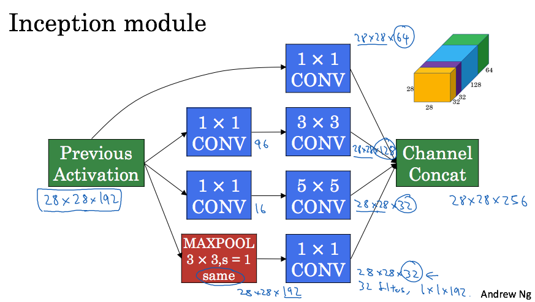
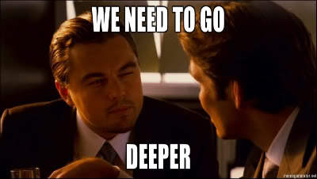
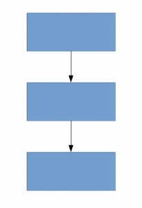
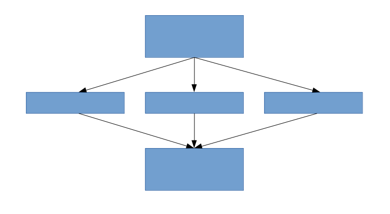
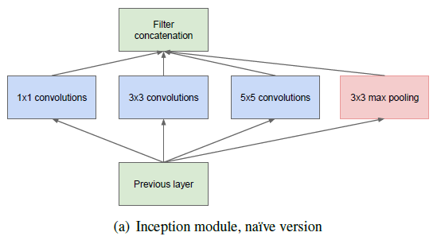
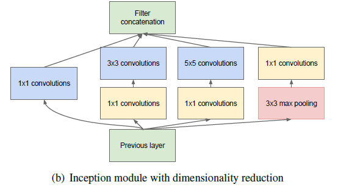
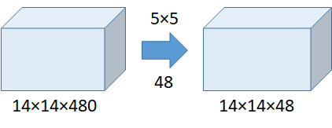
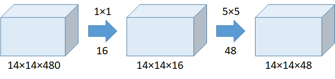
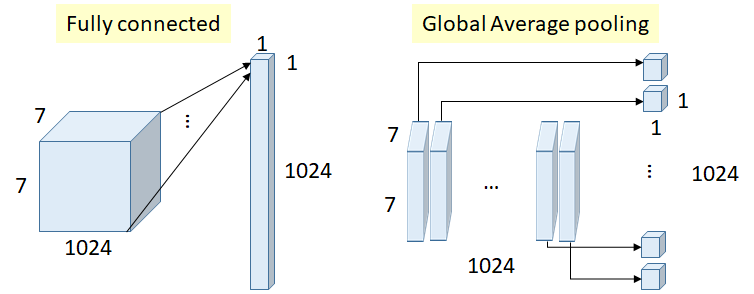
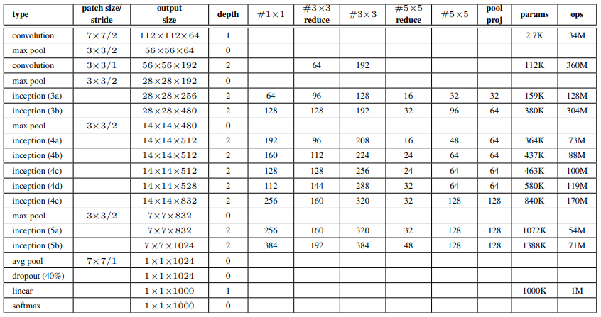

	

## Overview

GoogLeNet submission to ILSVRC 2014 actually uses 12× fewer parameters than the winning architecture of AlexNet from two years ago, while being significantly more accurate. For most of the experiments, the models were designed to keep a computational budget of 1.5 billion multiply-adds at inference time, so that the they do not end up to be a purely academic curiosity, but could be put to real world use, even on large datasets, at a reasonable cost. The name Inception derived from Network in network paper and famous “we need to go deeper” internet meme. 

	

## Related Work

Starting with LeNet-5, convolutional neural networks (CNN) have typically had a standard structure stacked convolutional layers (optionally followed by contrast normalization and max pooling) are followed by one or more fully-connected layers. Despite concerns that max-pooling layers result in loss of accurate spatial information, the same convolutional network architecture has also been successfully employed for localization, object detection and human pose estimation. Furthermore, Inception layers are repeated many times, leading to a 22-layer deep model in the case of the GoogLeNet model. 

Network-in-Network contains 1×1 convolutional layers. Here 1 × 1 convolutions have dual purpose: most critically, they are used mainly as dimension reduction modules to remove computational bottlenecks that would otherwise limit the size of our networks.	

## Motivation and High Level Considerations

The most straightforward way of improving the performance of deep neural networks is by increasing their size. However this simple solution comes with two major drawbacks. Bigger size typically means a larger number of parameters, which makes the enlarged network more prone to overfitting. Another drawback of uniformly increased network size is the dramatically increased use of computational resources. if two convolutional layers are chained, any uniform increase in the number of their filters results in a quadratic increase of computation.

The fundamental way of solving both issues would be by ultimately moving from fully connected to sparsely connected architectures, even inside the convolutions.  If the probability distribution of the data-set is representable by a large, very sparse deep neural network, then the optimal network topology can be constructed layer by layer by analyzing the correlation statistics of the activations of the last layer and clustering neurons with highly correlated outputs. Although the strict mathematical proof requires very strong conditions, the fact that this statement resonates with the well known Hebbian principle – neurons that fire together, wire together – suggests that the underlying idea is applicable even under less strict conditions, in practice. 

	

Dense Architecture

	

Sparse Architecture

## Architectural Details

The main idea of the Inception architecture is based on finding out how an optimal local sparse structure in a convolutional vision network can be approximated and covered by readily available dense components. All we need is to find the optimal local construction and to repeat it spatially.  Arora et al. suggests a layer-by layer construction in which one should analyze the correlation statistics of the last layer and cluster them into groups of units with high correlation. One can also expect that there will be a smaller number of more spatially spread out clusters that can be covered by convolutions over larger patches, and there will be a decreasing number of patches over larger and larger regions. In order to avoid patch alignment issues, current incarnations of the Inception architecture are restricted to filter sizes 1×1, 3×3 and 5×5.

As these “Inception modules” are stacked on top of each other, their output correlation statistics are bound to vary: as features of higher abstraction are captured by higher layers, their spatial concentration is expected to decrease suggesting that the ratio of 3×3 and 5×5 convolutions should increase as we move to higher layers. 

One big problem with the above modules, at least in this na¨ıve form, is that even a modest number of 5×5 convolutions can be prohibitively expensive on top of a convolutional layer with a large number of filters. This problem becomes even more pronounced once pooling units are added to the mix. This leads to the second idea of the proposed architecture: judiciously applying dimension reductions and projections wherever the computational requirements would increase too much otherwise.

	

	

This leads to the second idea of the proposed architecture: judiciously applying dimension reductions and projections wherever the computational requirements would increase too much otherwise. That is, 1×1 convolutions are used to compute reductions before the expensive 3×3 and 5×5 convolutions. Besides being used as reductions, they also include the use of rectified linear activation which makes them dual-purpose. 

### Use of 1×1 convolutions

Suppose we need to perform 5×5 convolution without the use of 1×1 convolution as Below

	

Number of operations = (14 × 14 × 48) × (5 × 5 × 480) = 112.9M

**With the use of 1×1 convolution:**

	

Number of operations for 1×1 = (14 × 14 × 16) × (1 × 1 × 480) = 1.5M

Number of operations for 5×5 = (14 × 14 × 48) × (5 × 5 × 16) = 3.8M

Total number of operations = 1.5M + 3.8M = 5.3M

which is much much smaller than 112.9M !

### Global Average Pooling

	

Previously, **fully connected (FC) layers** were used at the end of a network, such as in AlexNet. All inputs are connected to each output.

**Number of weights (connections) above = 7×7×1024×1024 = 51.3M**

In GoogLeNet, **global average pooling** is used nearly at the end of the network by averaging each feature map from 7×7 to 1×1, as in the figure above.

**Number of weights = 0**

And authors found that a move from FC layers to average pooling improved the top-1 accuracy by about 0.6%.

This is the idea from **NIN** which can be less prone to overfitting.

We may think that, when dimension is reduced, we are actually working on the mapping from high dimension to low dimension in a non-linearity way. In contrast, for PCA, it performs linear dimension reduction.

In general, an Inception network is a network consisting of modules of the above type stacked upon each other, with occasional max-pooling layers with stride 2 to halve the resolution of the grid. it seemed beneficial to start using Inception modules only at higher layers while keeping the lower layers in traditional convolutional fashion.

## GoogLeNet

This name is an homage to Yann LeCuns pioneering LeNet 5 network

	

All the convolutions, including those inside the Inception modules, use rectified linear activation. The size of the receptive field in our network is 224×224 taking RGB color channels with mean subtraction. “#3×3 reduce” and “#5×5 reduce” stands for the number of 1×1 filters in the reduction layer used before the 3×3 and 5×5 convolutions.

The network is 22 layers deep when counting only layers with parameters (or 27 layers if we also count pooling). The overall number of layers (independent building blocks) used for the construction of the network is about 100. A move from fully connected layers to average pooling improved the top-1 accuracy by about 0.6%, however the use of dropout remained essential even after removing the fully connected layers.

## Training Methodology

Authors used CPU based implementation only, a rough estimate suggests that the GoogLeNet network could be trained to converge using few high-end GPUs within a week, the main limitation being the memory usage. Training used asynchronous stochastic gradient descent with 0.9 momentum, fixed learning rate schedule (decreasing the learning rate by 4% every 8 epochs). Sampling of various sized patches of the image whose size is distributed evenly between 8% and 100% of the image area and whose aspect ratio is chosen randomly between 3/4 and 4/3. Also, the photometric distortions by Andrew Howard were useful to combat overfitting to some extent. In addition, they use random interpolation methods for resizing relatively late and in conjunction with other hyperparameter changes, so we could not tell definitely whether the final results were affected positively by their use.

As we can see there are some intermediate softmax branches at the middle, they are used for training only. These branches are auxiliary classifiers which consist of:

**5×5 Average Pooling (Stride 3)**

**1×1 Conv (128 filters)**

**1024 FC**

**1000 FC**

**Softmax**

The loss is added to the total loss, with weight 0.3.

**Authors claim it can be used for combating gradient vanishing problems, also providing regularization.**

And it is NOT used in testing or inference time.

## ILSVRC 2014 Classification Challenge Setup and Results

Authors independently trained 7 versions of the same GoogLeNet model (including one wider version), and performed ensemble prediction with them. These models were trained with the same initialization (even with the same initial weights, mainly because of an oversight) and learning rate policies, and they only differ in sampling methodologies and the random order in which they see input images.

During testing, they resize the image to 4 scales where the shorter dimension is 256, 288, 320 and 352 respectively, take the left, center and right square of these resized images. For each square, they then take the 4 corners and the center 224×224 crop as well as the square resized to 224×224, and their mirrored versions. This results in 4×3×6×2 = 144 crops per image. 

The softmax probabilities are averaged over multiple crops and over all the individual classifiers to obtain the final prediction. In experiments we analyzed alternative approaches on the validation data, such as max pooling over crops and averaging over classifiers, but they lead to inferior performance than the simple averaging. 

Their final submission in the challenge obtains a top-5 error of 6.67% on both the validation and testing data, ranking the first among other participants. This is a 56.5% reduction compared to the SuperVision approach , and about 40% relative reduction compared to the Clarifai, both of which used external data for training the classifiers.

### Results
 

	<table border="1px solid black">
		<tr>
			<th>Team</th>
			<th>Year</th>
			<th>Place</th>
			<th>Error (top-5)</th>
			<th>Uses external data</th>
		</tr>
		<tr>
			<td>SuperVision</td>
			<td>2012</td>
			<td>1st</td>
			<td>16.4%</td>
			<td>no</td>
		</tr>
		<tr>
			<td>SuperVision</td>
			<td>2012</td>
			<td>1st</td>
			<td>15.3%</td>
			<td>Imagenet 22k</td>
		</tr>
		<tr>
			<td>Clarifai</td>
			<td>2013</td>
			<td>1st</td>
			<td>11.7%</td>
			<td>no</td>
		</tr>
		<tr>
			<td>Clarifai</td>
			<td>2013</td>
			<td>1st</td>
			<td>11.2%</td>
			<td>Imagenet 22k</td>
		</tr>
		<tr>
			<td>MSRA</td>
			<td>2014</td>
			<td>3rd</td>
			<td>7.35%</td>
			<td>no</td>
		</tr>
		<tr>
			<td>VGG</td>
			<td>2014</td>
			<td>2nd</td>
			<td>7.32%</td>
			<td>no</td>
		</tr>
		<tr>
			<td>GoogLeNet</td>
			<td>2014</td>
			<td>1st</td>
			<td>6.67%</td>
			<td>no</td>
		</tr>
	</table>

  

	<table border="1px solid black">
		<tr>
			<th>Number of models</th>
			<th>Number of Crops</th>
			<th>Cost</th>
			<th>Top-5 error</th>
			<th>compared to base</th>
		</tr>
		<tr>
			<td>1</td>
			<td>1</td>
			<td>1</td>
			<td>10.07%</td>
			<td>base</td>
		</tr>
		<tr>
			<td>1</td>
			<td>10</td>
			<td>10</td>
			<td>9.15%</td>
			<td>-0.92%</td>
		</tr>
		<tr>
			<td>1</td>
			<td>144</td>
			<td>144</td>
			<td>7.89%</td>
			<td>-2.18%</td>
		</tr>
		<tr>
			<td>7</td>
			<td>1</td>
			<td>7</td>
			<td>8.09%</td>
			<td>-1.98%</td>
		</tr>
		<tr>
			<td>7</td>
			<td>10</td>
			<td>70</td>
			<td>7.62%</td>
			<td>-2.45%</td>
		</tr>
		<tr>
			<td>7</td>
			<td>144</td>
			<td>1008</td>
			<td>6.67%</td>
			<td>-3.45%</td>
		</tr>
	</table>

  
## ILSVRC 2014 Detection Challenge Setup and Results

The approach taken by GoogLeNet for detection is similar to the R-CNN, but is augmented with the Inception model as the region classifier. Additionally, the region proposal step is improved by combining the Selective Search approach with multi-box predictions for higher object bounding box recall. In order to cut down the number of false positives, the superpixel size was increased by 2×. This halves the proposals coming from the selective search algorithm. They added back 200 region proposals coming from multi-box resulting, in total, in about 60% of the proposals used by, while increasing the coverage from 92% to 93%. The overall effect of cutting the number of proposals with increased coverage is a 1% improvement of the mean average precision for the single model case. Finally, they use an ensemble of 6 ConvNets when classifying each region which improves results from 40% to 43.9% accuracy. 

### Results
 

	<table border="1px solid black" style="text-align:center">
		<tr>
			<th>Team</th>
			<th>Year</th>
			<th>Price</th>
			<th>mAP</th>
			<th>External data</th>
			<th>ensemble</th>
			<th>approach</th>
		</tr>
		<tr>
			<td>UvA-Euvision</td>
			<td>2013</td>
			<td>1st</td>
			<td>22.6%</td>
			<td>none</td>
			<td>?</td>
			<td>Fisher vectors</td>
		</tr>
		<tr>
			<td>Deep Insight</td>
			<td>2014</td>
			<td>3rd</td>
			<td>40.5%</td>
			<td>ImageNet 1k</td>
			<td>3</td>
			<td>CNN</td>
		</tr>
		<tr>
			<td>CUHK DeepID-Net</td>
			<td>2014</td>
			<td>2nd</td>
			<td>40.7%</td>
			<td>ImageNet 1k</td>
			<td>?</td>
			<td>CNN</td>
		</tr>
		<tr>
			<td>GoogLeNet</td>
			<td>2014</td>
			<td>1st</td>
			<td>4.9%</td>
			<td>ImageNet 1k</td>
			<td>6</td>
			<td>CNN</td>
		</tr>
	</table>

  

	<table border="1px solid black">
		<tr>
			<th>Team</th>
			<th>mAP</th>
			<th>Contextual model</th>
			<th>Bounding box regression</th>
		</tr>
		<tr>
			<td>Trimps-Soushen</td>
			<td>31.6%</td>
			<td>no</td>
			<td>?</td>
		</tr>
		<tr>
			<td>Berkeley Vision</td>
			<td>34.5%</td>
			<td>no</td>
			<td>yes</td>
		</tr>
		<tr>
			<td>UvA-Euvision</td>
			<td>35.4%</td>
			<td>?</td>
			<td>?</td>
		</tr>
		<tr>
			<td>CUHK DeepID-Net2</td>
			<td>37.7%</td>
			<td>no</td>
			<td>?</td>
		</tr>
		<tr>
			<td>GoogLeNet</td>
			<td>38.2%</td>
			<td>no</td>
			<td>no</td>
		</tr>
		<tr>
			<td>Deep Insight</td>
			<td>40.2</td>
			<td>yes</td>
			<td>yes</td>
		</tr>
	</table>

## Implementation

Implementation of GoogLeNet Architecture in keras and pytorch can be found [here](https://github.com/DhruvMakwana/Computer_Vision/tree/master/GoogLeNet)

## Reference:

https://arxiv.org/pdf/1409.4842.pdf
