## Problem Overview:

Open up your pantry and you’re likely to find several wheat products. Indeed, your morning toast or cereal may rely upon this common grain. Its popularity as a food and crop makes wheat widely studied. To get large and accurate data about wheat fields worldwide, plant scientists use image detection of "wheat heads"—spikes atop the plant containing grain. These images are used to estimate the density and size of wheat heads in different varieties. Farmers can use the data to assess health and maturity when making management decisions in their fields.

However, accurate wheat head detection in outdoor field images can be visually challenging. There is often overlap of dense wheat plants, and the wind can blur the photographs. Both make it difficult to identify single heads. Additionally, appearances vary due to maturity, color, genotype, and head orientation. Finally, because wheat is grown worldwide, different varieties, planting densities, patterns, and field conditions must be considered. Models developed for wheat phenotyping need to generalize between different growing environments. Current detection methods involve one- and two-stage detectors (Yolo-V3 and Faster-RCNN), but even when trained with a large dataset, a bias to the training region remains.

The Global Wheat Head Dataset is led by nine research institutes from seven countries: the University of Tokyo, Institut national de recherche pour l’agriculture, l’alimentation et l’environnement, Arvalis, ETHZ, University of Saskatchewan, University of Queensland, Nanjing Agricultural University, and Rothamsted Research. These institutions are joined by many in their pursuit of accurate wheat head detection, including the Global Institute for Food Security, DigitAg, Kubota, and Hiphen.

In this competition, you’ll detect wheat heads from outdoor images of wheat plants, including wheat datasets from around the globe. Using worldwide data, you will focus on a generalized solution to estimate the number and size of wheat heads. To better gauge the performance for unseen genotypes, environments, and observational conditions, the training dataset covers multiple regions. You will use more than 3,000 images from Europe (France, UK, Switzerland) and North America (Canada). The test data includes about 1,000 images from Australia, Japan, and China.

Wheat is a staple across the globe, which is why this competition must account for different growing conditions. Models developed for wheat phenotyping need to be able to generalize between environments. If successful, researchers can accurately estimate the density and size of wheat heads in different varieties. With improved detection farmers can better assess their crops, ultimately bringing cereal, toast, and other favorite dishes to your table.


## Data:

More details on the data acquisition and processes are available at https://arxiv.org/abs/2005.02162

Data Format: The data is images of wheat fields, with bounding boxes for each identified wheat head. Not all images include wheat heads / bounding boxes. The images were recorded in many locations around the world.

The CSV data is simple - the image ID matches up with the filename of a given image, and the width and height of the image are included, along with a bounding box. There is a row in train.csv for each bounding box. Not all images have bounding boxes.

Goal: The goal is to predict bounding boxes around each wheat head in images that have them. If there are no wheat heads, you must predict no bounding boxes.

## File Structure:

1. train.csv - the training data
2. sample_submission.csv - a sample submission file in the correct format
3. train.zip - training images
4. test.zip - test images

## Fields in csv:

1. image_id - the unique image ID
2. width, height - the width and height of the images
3. bbox - a bounding box, formatted as a Python-style list of [xmin, ymin, width, height].

## Exploratory Data Analysis

```python
# importing libraries
import os
from glob import glob
import pandas as pd
import matplotlib.pyplot as plt
import numpy as np
from PIL import Image
import matplotlib.patches as patches
from bokeh.models import ColumnDataSource, HoverTool, Panel
from bokeh.plotting import figure
from bokeh.io import output_notebook, show, output_file
import cv2
import albumentations as albu
from albumentations.pytorch.transforms import ToTensor
from albumentations.core.transforms_interface import DualTransform
from albumentations.augmentations.bbox_utils import denormalize_bbox, normalize_bbox
```

All necessary libraries for importing preprocessing and plotting is imported. `bokeh` is used for stylish histograms and `albumentations` is used for Data Augmentation.

```python
# setup directory and files
base_dir = "/content/drive/My Drive/Dataset"
train_dir = os.path.join(base_dir, 'Train/')
test_dir = os.path.join(base_dir, 'Test/')
train_dataframe = os.path.join(base_dir, 'train.csv')
```

We used Google Drive to load data from and to store data into, and Google Colab for training. So, setup directory and file path accordingly. `base_dir` is used to indicate base directory path. `train_dir` is used to indicate train images directory where all train images are stored. `test_dir` is used to indicate test images directory where all test images are stored. `train_dataframe` is used to indicate CSV file which contains image_id and bboxes. 

```python
# number of images in train and test
print("Number of Training images are: {}".format(len(glob(train_dir + '*'))))
print("Number of Testing images are: {}".format(len(glob(test_dir + '*'))))
```

```python
output: 
Number of Training images are: 3422
Number of Testing images are: 10
```

We have a total of 3422 train images and a total of 10 test images and other images are hidden which will be used at submission. We need to submit bboxes results for these 10 test images. Its mentioned in the problem overview that not all images are having a bounding box. so let's check how many of the images are not having a bounding box. Firstly load data frame.

```python
# load dataframe
df = pd.read_csv(train_dataframe)
df.head()
```

```python
output:

	image_id	width	height	bbox	source
0	b6ab77fd7	1024	1024	[834.0, 222.0, 56.0, 36.0]	usask_1
1	b6ab77fd7	1024	1024	[226.0, 548.0, 130.0, 58.0]	usask_1
2	b6ab77fd7	1024	1024	[377.0, 504.0, 74.0, 160.0]	usask_1
3	b6ab77fd7	1024	1024	[834.0, 95.0, 109.0, 107.0]	usask_1
4	b6ab77fd7	1024	1024	[26.0, 144.0, 124.0, 117.0]	usask_1
```

We can notice that images have the shape of 1024x1024. We need all images to be the same size. Therefore let's check if there are images that have a different shape.

```python
# is there any data with width or height greater than or less than 1024
print(df[df['width'] > 1024])
print("--------------")
print(df[df['width'] < 1024])
print("--------------")
print(df[df['height'] > 1024])
print("--------------")
print(df[df['height'] < 1024])
```

```python
output:
Empty DataFrame
Columns: [image_id, width, height, bbox, source]
Index: []
--------------
Empty DataFrame
Columns: [image_id, width, height, bbox, source]
Index: []
--------------
Empty DataFrame
Columns: [image_id, width, height, bbox, source]
Index: []
--------------
Empty DataFrame
Columns: [image_id, width, height, bbox, source]
Index: []
```

**Observation:** So, there are no data items with width or height greater than or less than 1024.

Its mentioned in Problem Overview that we have more than one image source. In the next line, we count the number of images per Source to check if we have a balanced dataset or an imbalanced dataset. 

```python
# How many images from each sources
df['source'].value_counts()
```

```python
output:
ethz_1       51489
arvalis_1    45716
rres_1       20236
arvalis_3    16665
usask_1       5807
arvalis_2     4179
inrae_1       3701
Name: source, dtype: int64
```

Now lets extract values from bbox columns and make 4 new columns which help in making bboxes for yolo. To do so first we replace null values in the list with 0, then assign 4 values for bbox_xmin, bbox_ymin, bbox_width, and bbox_height from the list of bbox column. 

```python
training_images_dataframe = pd.DataFrame([fns.split('/')[-1][:-4] for fns in glob(train_dir + '*')])
training_images_dataframe.columns=['image_id']

# merge it with bboxes dataframe
training_images_dataframe = training_images_dataframe.merge(df, on='image_id', how='left')

# replace null values with list of 0
training_images_dataframe['bbox'] = training_images_dataframe.bbox.fillna('[0,0,0,0]')

# split bboxes column
bbox_items = training_images_dataframe.bbox.str.split(',', expand=True)
training_images_dataframe['bbox_xmin'] = bbox_items[0].str.strip('[ ').astype(float)
training_images_dataframe['bbox_ymin'] = bbox_items[1].str.strip(' ').astype(float)
training_images_dataframe['bbox_width'] = bbox_items[2].str.strip(' ').astype(float)
training_images_dataframe['bbox_height'] = bbox_items[3].str.strip(' ]').astype(float)

print('Number of images without heads are: {}'.format(len(training_images_dataframe) - len(df)))
```

```python
output:
Number of images without heads are: 49
```

The following code is used for extracting bboxes from the data frame and plotting images with bboxes.

```python
# This function will take dataframe and image_id for which we want bounding boxes and return list of x, y, w, h
def get_all_bboxes(dataframe, image_id):
	image_bounding_boxes = dataframe[dataframe.image_id == image_id]
	bounding_boxes = []

	for _, row in image_bounding_boxes.iterrows():
		bounding_boxes.append((row.bbox_xmin, row.bbox_ymin, row.bbox_width, row.bbox_height))

	return bounding_boxes
```

```python
# This function will use to plot different examples. it will take dataframe, rows and cols for how many examples to 
# display and title and size of plot

def plot_image_examples(dataframe, rows = 3, cols = 3, title = 'Image examples', size = (10, 10)):
	fig, axs = plt.subplots(rows, cols, figsize=size)
	for row in range(rows):
		for col in range(cols):
			idx = np.random.randint(len(dataframe), size = 1)[0]
			img_id = dataframe.iloc[idx].image_id

			img = Image.open(train_dir + img_id + '.jpg')
			axs[row, col].imshow(img)

			bboxes = get_all_bboxes(dataframe, img_id)

			for bbox in bboxes:
				rect = patches.Rectangle((bbox[0], bbox[1]), bbox[2], bbox[3], linewidth=1, edgecolor='r', facecolor='none')
				axs[row, col].add_patch(rect)
				axs[row, col].axis('off')    
	plt.suptitle(title)
```

Following line of code uses above function to plot sample of trainig images

```python
plot_image_examples(training_images_dataframe)
```

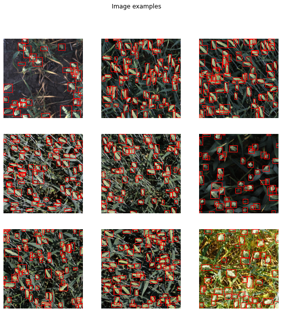

We need min and max of the bbox instead of height and width for some plotting. Next lines of code will compute xmax, ymax, area, and the number of bbox per image.

```python
# number of bouding boxes per train image
training_images_dataframe['count'] = training_images_dataframe.apply(lambda row: 1 if np.isfinite(row.width) else 0, axis=1)
training_images_count = training_images_dataframe.groupby('image_id').sum().reset_index()

training_images_dataframe['bbox_xmax'] = training_images_dataframe['bbox_xmin'] + training_images_dataframe['bbox_width']
training_images_dataframe['bbox_ymax'] = training_images_dataframe['bbox_ymin'] + training_images_dataframe['bbox_height']
training_images_dataframe['area'] = training_images_dataframe['bbox_width'] * training_images_dataframe['bbox_height']

```

The next function will plot different types of histograms with Bokeh. It takes data frame, the column for which we want histogram, color palate, bins for axes and title, and return histogram.

For more information on how histograms work follow this blog

https://towardsdatascience.com/interactive-histograms-with-bokeh-202b522265f3

```python
def hist_hover(dataframe, column, colors=["#94c8d8", "#ea5e51"], bins=30, title=''):
	hist, edges = np.histogram(dataframe[column], bins = bins)

	hist_df = pd.DataFrame({column: hist,
							"left": edges[:-1],
							"right": edges[1:]})
	hist_df["interval"] = ["%d to %d" % (left, right) for left,
							right in zip(hist_df["left"], hist_df["right"])]

	src = ColumnDataSource(hist_df)
	plot = figure(plot_height = 400, plot_width = 600,
				  title = title,
				  x_axis_label = column,
				  y_axis_label = "Count")    
	plot.quad(bottom = 0, top = column,left = "left", 
			  right = "right", source = src, fill_color = colors[0], 
			  line_color = "#35838d", fill_alpha = 0.7,
			  hover_fill_alpha = 0.7, hover_fill_color = colors[1])

	hover = HoverTool(tooltips = [('Interval', '@interval'), ('Count', str("@" + column))])
	plot.add_tools(hover)

	output_notebook()
	show(plot)
```

Let's plot count using the above images.

```python
hist_hover(training_images_count, 'count', title='Number of wheat spikes per image')
```

Images with less number of spikes

```python
less_spikes_ids = training_images_count[training_images_count['count'] < 10].image_id
plot_image_examples(training_images_dataframe[training_images_dataframe.image_id.isin(less_spikes_ids)], title='Example images with small number of spikes')
```

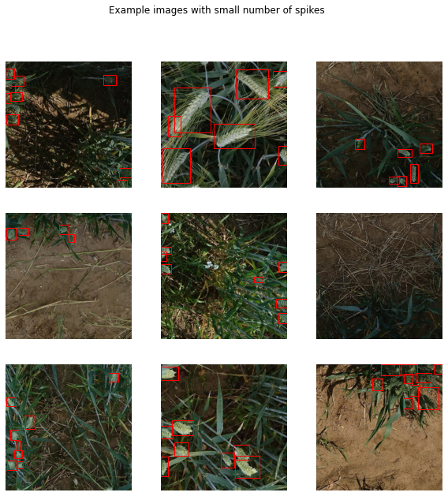

Images with more number of spikes

```python
many_spikes_ids = training_images_count[training_images_count['count'] > 100].image_id
plot_image_examples(training_images_dataframe[training_images_dataframe.image_id.isin(many_spikes_ids)], title='Example images with large number of spikes')
```

Now let's Visualize images of Wheat with a different source of data

```python
# Image with usask_1 source
usask_1_images = training_images_dataframe[training_images_dataframe['source'] == 'usask_1'].image_id
plot_image_examples(training_images_dataframe[training_images_dataframe.image_id.isin(usask_1_images)], rows=2, cols=2, size=(15, 15), title='Images with source usask_1')
```

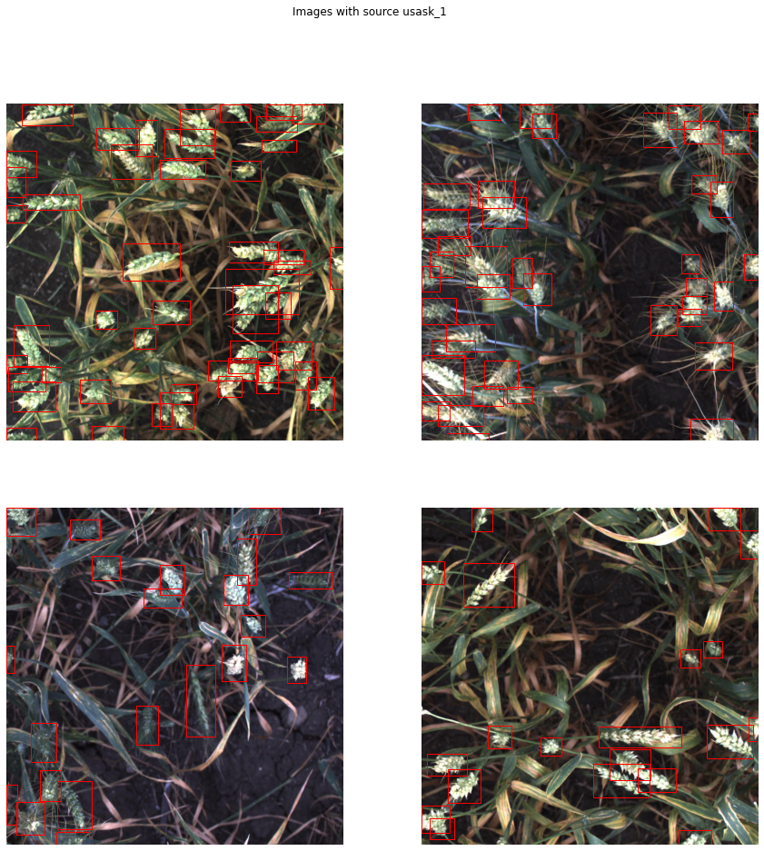

```python
# Image with arvalis_1 source
arvalis_1_images = training_images_dataframe[training_images_dataframe['source'] == 'arvalis_1'].image_id
plot_image_examples(training_images_dataframe[training_images_dataframe.image_id.isin(arvalis_1_images)], rows=2, cols=2, size=(15, 15), title='Images with source arvalis_1')
```

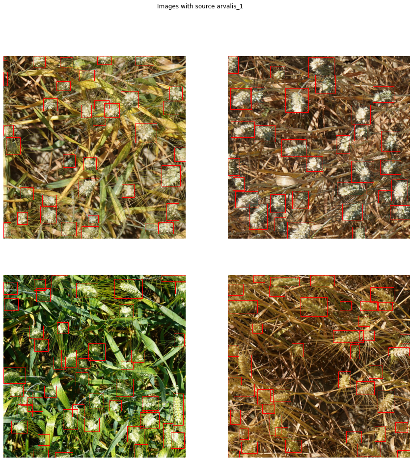

```python
# Image with inrae_1 source
inrae_1_images = training_images_dataframe[training_images_dataframe['source'] == 'inrae_1'].image_id
plot_image_examples(training_images_dataframe[training_images_dataframe.image_id.isin(inrae_1_images)], rows=2, cols=2, size=(15, 15), title='Images with source inrae_1')
```

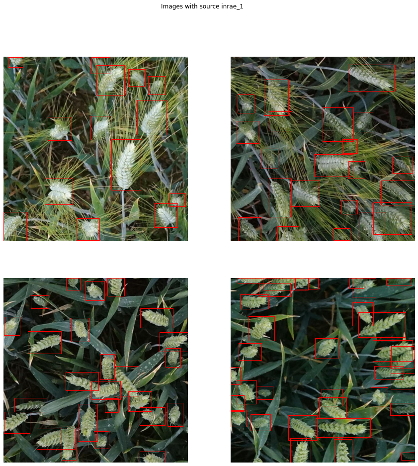

```python
# Image with arvalis_3 source
arvalis_3_images = training_images_dataframe[training_images_dataframe['source'] == 'arvalis_3'].image_id
plot_image_examples(training_images_dataframe[training_images_dataframe.image_id.isin(arvalis_3_images)], rows=2, cols=2, size=(15, 15), title='Images with source arvalis_3')
```

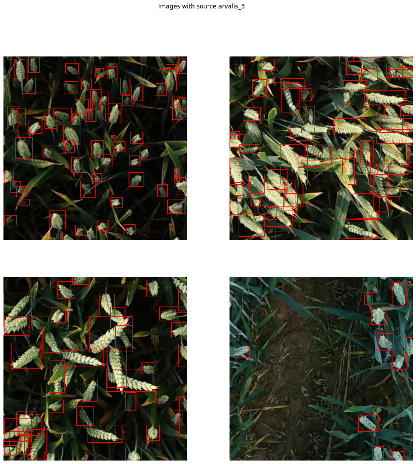

```python
# Image with rres_1 source
rres_1_images = training_images_dataframe[training_images_dataframe['source'] == 'rres_1'].image_id
plot_image_examples(training_images_dataframe[training_images_dataframe.image_id.isin(rres_1_images)], rows=2, cols=2, size=(15, 15), title='Images with source rres_1')
```

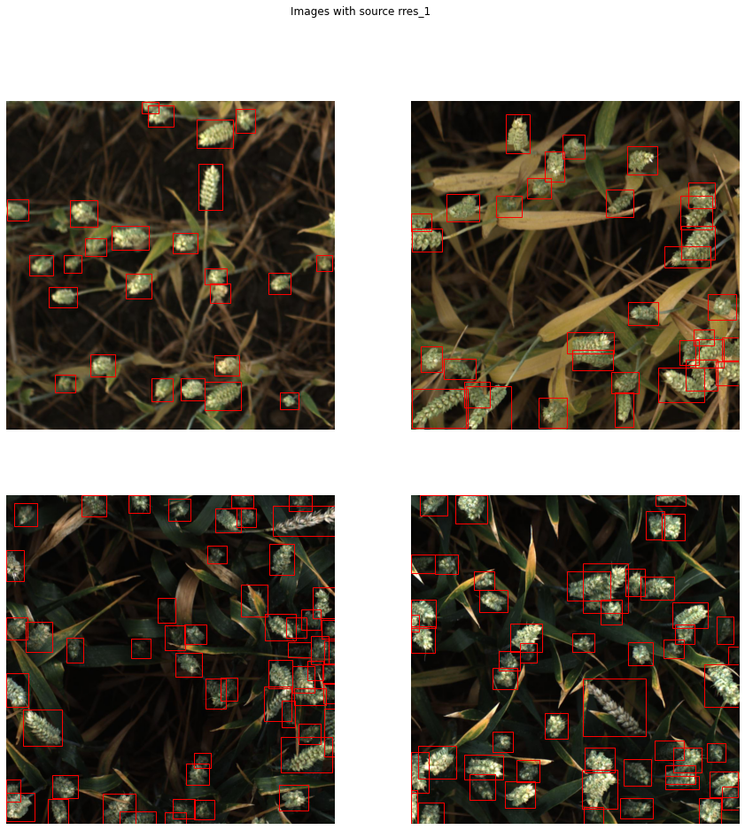

```python
# Image with arvalis_2 source
arvalis_2_images = training_images_dataframe[training_images_dataframe['source'] == 'arvalis_2'].image_id
plot_image_examples(training_images_dataframe[training_images_dataframe.image_id.isin(arvalis_2_images)], rows=2, cols=2, size=(15, 15), title='Images with source arvalis_2')
```

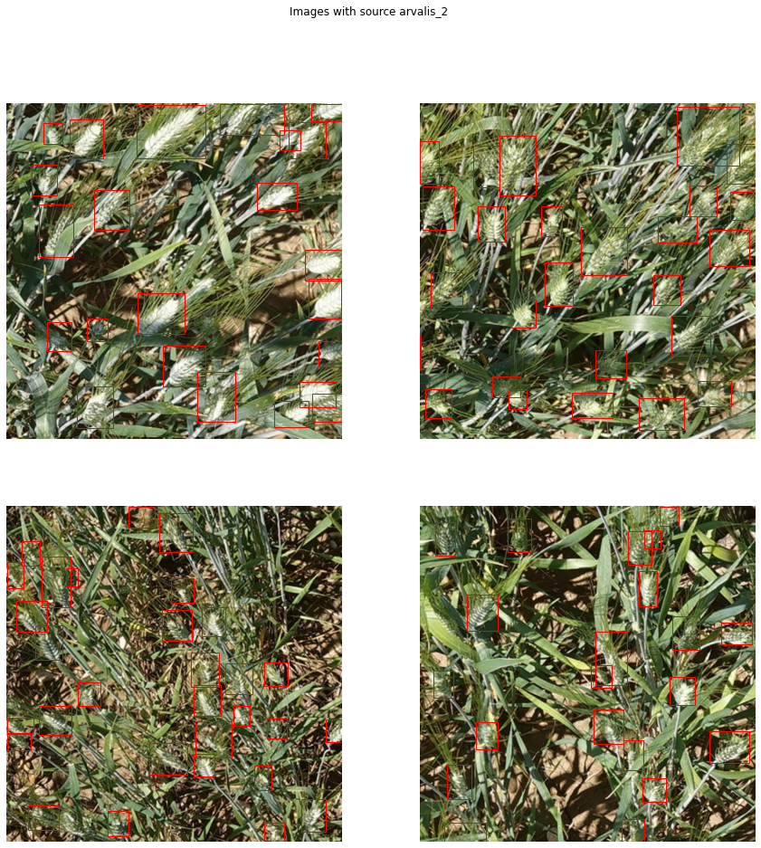

```python
# Image with ethz_1 source
ethz_1_images = training_images_dataframe[training_images_dataframe['source'] == 'ethz_1'].image_id
plot_image_examples(training_images_dataframe[training_images_dataframe.image_id.isin(ethz_1_images)], rows=2, cols=2, size=(15, 15), title='Images with source ethz_1')
```

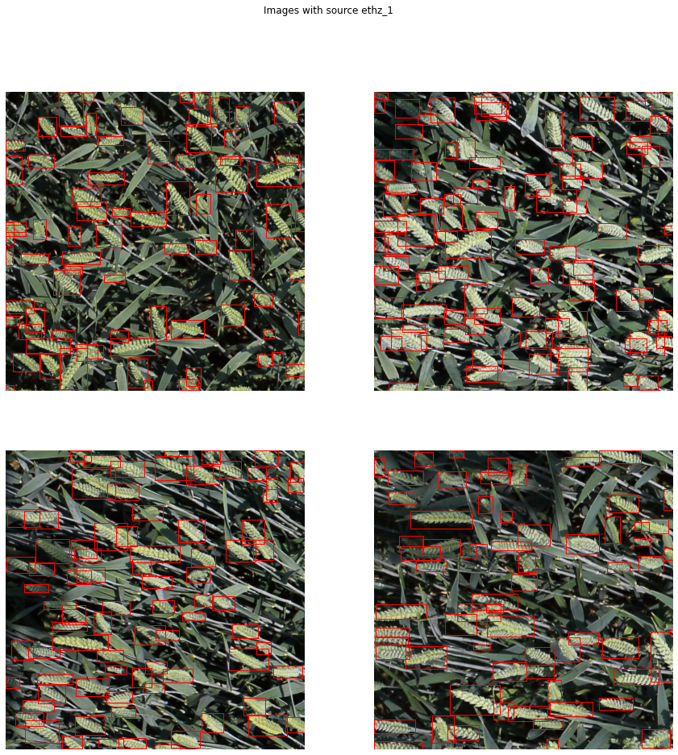

Let's compute bbox area to plot images with large bboxes images. but what is the maximum bbox area?

```python
# areas of bboxes
training_images_dataframe['bbox_area'] = training_images_dataframe['bbox_width'] * training_images_dataframe['bbox_height']
print(training_images_dataframe.bbox_area.max())
```

```python
output:
529788.0
```

```python
# Example images with large bounding box area
large_boxes_ids = training_images_dataframe[training_images_dataframe['bbox_area'] > 200000].image_id
plot_image_examples(training_images_dataframe[training_images_dataframe.image_id.isin(large_boxes_ids)], title='Example images with large bbox area')
```

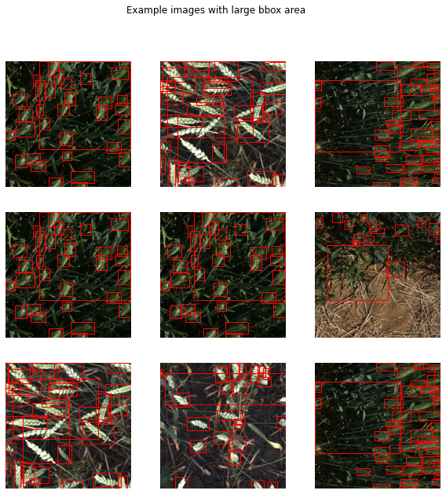

The following line of code will plot images with a small bounding boxes area. But what is the smallest bounding box area?

```python
min_area = training_images_dataframe[training_images_dataframe['bbox_area'] > 0].bbox_area.min()
print('The smallest bouding box area is {}'.format(min_area))
```

```python
output:
The smallest bouding box area is 2.0
```

```python
# Example images with small bounding box area
small_boxes_ids = training_images_dataframe[(training_images_dataframe['bbox_area'] < 25) & (training_images_dataframe['bbox_area'] > 0)].image_id
plot_image_examples(training_images_dataframe[training_images_dataframe.image_id.isin(small_boxes_ids)], title='Example images with small bbox area')
```

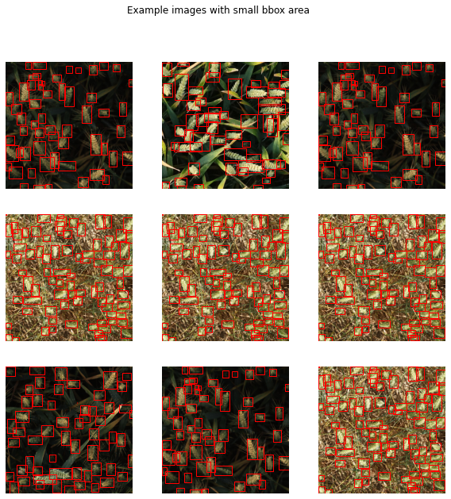

Not let's try some augmentation technique. The following lines of code will generate images with Random Sized BBox Safe Crop, Horizontal Flip, Vertical Flip, Random Contrast, Random Gamma, Random Brightness, etc. 

```python
# Here we are trying little Augmentation
example_transforms = albu.Compose([
	albu.RandomSizedBBoxSafeCrop(512, 512, erosion_rate=0.0, interpolation=1, p=1.0),
	albu.HorizontalFlip(p=0.5),
	albu.VerticalFlip(p=0.5),
	albu.OneOf([albu.RandomContrast(),
                albu.RandomGamma(),
                albu.RandomBrightness()], p=1.0),
    albu.CLAHE(p=1.0)], p=1.0)

```

```python
def apply_transforms(transforms, df, n_transforms=3):
	idx = np.random.randint(len(df), size=1)[0]

	image_id = df.iloc[idx].image_id
	bboxes = []
	for _, row in df[df.image_id == image_id].iterrows():
		bboxes.append([row.bbox_xmin, row.bbox_ymin, row.bbox_width, row.bbox_height])

	image = Image.open(train_dir + image_id + '.jpg')
	fig, axs = plt.subplots(1, n_transforms+1, figsize=(15,7))

	# plot the original image
	axs[0].imshow(image)
	axs[0].set_title('original')
	for bbox in bboxes:
		rect = patches.Rectangle((bbox[0],bbox[1]),bbox[2],bbox[3],linewidth=1,edgecolor='r',facecolor='none')
		axs[0].add_patch(rect)

	# apply transforms n_transforms times
	for i in range(n_transforms):
		params = {'image': np.asarray(image),
				  'bboxes': bboxes,
				  'category_id': [1 for j in range(len(bboxes))]}
		augmented_boxes = transforms(**params)
		bboxes_aug = augmented_boxes['bboxes']
		image_aug = augmented_boxes['image']

		# plot the augmented image and augmented bounding boxes
		axs[i+1].imshow(image_aug)
		axs[i+1].set_title('augmented_' + str(i+1))
		for bbox in bboxes_aug:
			rect = patches.Rectangle((bbox[0],bbox[1]),bbox[2],bbox[3],linewidth=1,edgecolor='r',facecolor='none')
			axs[i+1].add_patch(rect)
	plt.show()
```

```python
apply_transforms(example_transforms, training_images_dataframe, n_transforms=3)
```

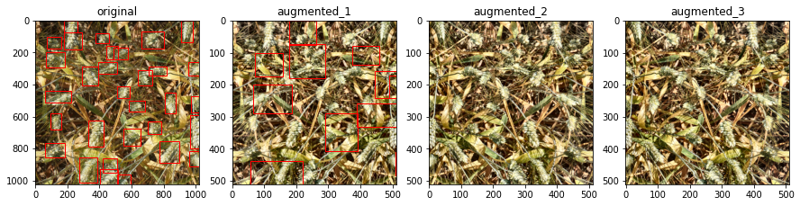

```python
apply_transforms(example_transforms, training_images_dataframe, n_transforms=3)
```

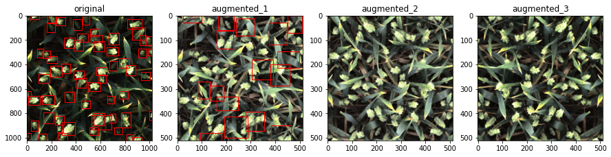

For more detail of EDA with Global Wheat Detection and full code visit [here](https://github.com/DhruvMakwana/Global-Wheat-Detection/blob/master/Global_Wheat_Detection_EDA.ipynb)

Now we will train yolov4 on this dataset. Yolov4 needs labels annotations in yolo format. The next task is to create yolo format labels for training images.

```python
# Importing libraries
import numpy as np
import matplotlib.pyplot as plt
import pandas as pd
import cv2
import warnings
import os
from glob import glob
import shutil
warnings.filterwarnings('ignore')
```

First import necessary libraries to load data frame and visualize results. Next, we will set up a directory and file structure.

```python
# setup directory and files
base_dir = "/content/drive/My Drive/Dataset"
train_dataframe = os.path.join(base_dir, 'train.csv')
train_dir = os.path.join(base_dir, 'Train/')
data_dir = os.path.join(base_dir, 'Data/')
if not os.path.exists(data_dir):
	print("Directory Created")
	os.makedirs(data_dir)
```

Here we will create a new folder named `data` in the base directory which will contain images and labels for images. Now lets load data frame.

```python
# Load dataframe
train_df = pd.read_csv(train_dataframe)
train_df.head()
```
```python
output:
	image_id	width	height	bbox	source
0	b6ab77fd7	1024	1024	[834.0, 222.0, 56.0, 36.0]	usask_1
1	b6ab77fd7	1024	1024	[226.0, 548.0, 130.0, 58.0]	usask_1
2	b6ab77fd7	1024	1024	[377.0, 504.0, 74.0, 160.0]	usask_1
3	b6ab77fd7	1024	1024	[834.0, 95.0, 109.0, 107.0]	usask_1
4	b6ab77fd7	1024	1024	[26.0, 144.0, 124.0, 117.0]	usask_1
```

We only need image_id and bounding box so let's create a new data frame that consists of image_id and bounding box only.

```python
# create new dataframe with 2 columns image_id and bbox
img_bb = train_df[['image_id','bbox']]

# converting string to list
img_bb['bbox'] = img_bb['bbox'].str.strip('][').str.split(',')
img_bb.head()
```

```python
output:
	image_id	bbox
0	b6ab77fd7	[834.0, 222.0, 56.0, 36.0]
1	b6ab77fd7	[226.0, 548.0, 130.0, 58.0]
2	b6ab77fd7	[377.0, 504.0, 74.0, 160.0]
3	b6ab77fd7	[834.0, 95.0, 109.0, 107.0]
4	b6ab77fd7	[26.0, 144.0, 124.0, 117.0]
```

Now let's define some new empty parameters which we will need afterward.

```python
# define some new empty features
img_bb['x'] =''
img_bb['y'] =''
img_bb['w'] =''
img_bb['h'] =''
img_bb['xy_min'] = ''
img_bb['xy_max'] = ''
img_bb.head()
```

```python
output:
	image_id	bbox	x	y	w	h	xy_min	xy_max
0	b6ab77fd7	[834.0, 222.0, 56.0, 36.0]						
1	b6ab77fd7	[226.0, 548.0, 130.0, 58.0]						
2	b6ab77fd7	[377.0, 504.0, 74.0, 160.0]						
3	b6ab77fd7	[834.0, 95.0, 109.0, 107.0]						
4	b6ab77fd7	[26.0, 144.0, 124.0, 117.0]
```

Its time to fill these Empty Columns. The following line will loop through whole data and update newly created features, and print the first 5 rows. 

```python
# This loop will loop through whole data and update newly created features
%%time
for i in range(len(img_bb)):
	img_bb.iloc[i,1] = pd.to_numeric(img_bb.iloc[i,1], downcast='integer')
	img_bb.loc[i, 'x'] = img_bb.loc[i, 'bbox'][0]
	img_bb.loc[i, 'y'] = img_bb.loc[i, 'bbox'][1]
	img_bb.loc[i, 'w'] = img_bb.loc[i, 'bbox'][2]
	img_bb.loc[i, 'h'] = img_bb.loc[i, 'bbox'][3]
	img_bb.loc[i, 'xy_min'] = (int(img_bb.loc[i, 'x']), int(img_bb.loc[i, 'y']))
	img_bb.loc[i, 'xy_max'] = (int(img_bb.loc[i, 'x'] + img_bb.loc[i, 'w']), int(img_bb.loc[i, 'y'] + img_bb.loc[i, 'h']))
	if i % 3000 == 0:
		print('iter:' ,i)
img_bb.head()
```

```python
output:

CPU times: user 5min 33s, sys: 8.27 s, total: 5min 41s
Wall time: 5min 27s

	image_id	bbox				x	y	w	h	xy_min		xy_max
0	b6ab77fd7	[834, 222, 56, 36]	834	222	56	36	(834, 222)	(890, 258)
1	b6ab77fd7	[226, 548, 130, 58]	226	548	130	58	(226, 548)	(356, 606)
2	b6ab77fd7	[377, 504, 74, 160]	377	504	74	160	(377, 504)	(451, 664)
3	b6ab77fd7	[834, 95, 109, 107]	834	95	109	107	(834, 95)	(943, 202)
4	b6ab77fd7	[26, 144, 124, 117]	26	144	124	117	(26, 144)	(150, 261)
```

Now we have data in Yolo format so let's try plotting one image with a bounding box to check if we have correct data format.

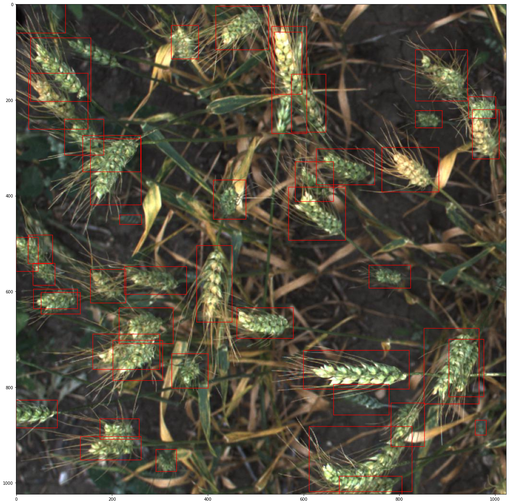

## Converting into yolo label

```python
image_id_list = train_df['image_id'].unique()
train_dir_images_list = os.listdir(train_dir)
print('Number of images without label: {}'.format(len(train_dir_images_list) - len(image_id_list)))
```

```python
output:
Number of images without label: 49
```

We need labels in .txt files each for one image. So lets first create blank {image_id}.txt and then fill data in the {image_id}.txt files.

Becuase 49 images dont have labels and it will cuase error while training  

```python
for img in train_dir_images_list:
	f  = open(data_dir + img[:-4] + ".txt", "w")
	f.close()
```

Now loop through all .txt files to fill with labels.

```python
label = pd.DataFrame()

# This loop will generate center_x, center_y and width and height feature and write it in {image_id}.txt in yolo format

%%time
for j , id in enumerate(image_id_list):
	temp_df = train_df[train_df['image_id']== id][['image_id','bbox']]
	temp_df['bbox'] = temp_df['bbox'].str.strip('][').str.split(',')
	temp_df['x_min'] =''
	temp_df['y_min'] =''
	temp_df['w'] =''
	temp_df['h'] =''
	temp_df['x_center'] = ''
	temp_df['y_center'] = ''
	temp_df['yolo_w'] =''
	temp_df['yolo_h'] =''
	f  = open(data_dir + id + ".txt", "w+")
	for i in temp_df.index:
		temp_df.loc[i,'bbox'] = pd.to_numeric(temp_df.loc[i,'bbox'],downcast='integer')
		temp_df.loc[i,'x_min'] = temp_df.loc[i,'bbox'][0]
		temp_df.loc[i,'y_min'] = temp_df.loc[i,'bbox'][1]
		temp_df.loc[i,'w'] = temp_df.loc[i,'bbox'][2]
		temp_df.loc[i,'h'] = temp_df.loc[i,'bbox'][3]
		temp_df.loc[i,'x_center'] = np.round((temp_df.loc[i,'x_min'] + int(temp_df.loc[i,'w']/2))/1024,6)
		temp_df.loc[i,'y_center'] = np.round((temp_df.loc[i,'y_min'] + int(temp_df.loc[i,'h']/2))/1024,6)
		temp_df.loc[i,'yolo_w'] = np.round(temp_df.loc[i,'w']/1024,6)
		temp_df.loc[i,'yolo_h'] = np.round(temp_df.loc[i,'h']/1024,6)
		f.write(str(0)+' '+str(temp_df.loc[i,'x_center'])+' ' +str(temp_df.loc[i,'y_center'])+' '+str(temp_df.loc[i,'yolo_w'])+' '+str(temp_df.loc[i,'yolo_h'])+'\n')
	f.close()
	label = label.append(temp_df)
```

```python
output:
CPU times: user 8min 31s, sys: 2.66 s, total: 8min 34s
Wall time: 8min 55s
```

Now we have 3422 files in the data directory. let's check it.

```python
# Expected length should be 3422 one txt file for each image
print("Length of data folder we created is: {}".format(len(glob(data_dir + "*"))))
```

Next, we need to move all images to the data directory where we have all labels ready.
```python
%%time
files = os.listdir(train_dir)
for f in files:
	shutil.copy(train_dir + "/" + f, data_dir)
```

```python
output:
CPU times: user 2.99 s, sys: 2.69 s, total: 5.69 s
Wall time: 14min 52s
```

Now we have 3422 * 2 = 6844 files in the data directory. let's check it.


```python
# Expected length should be 3422*2 = 6844
print("Length of label folder we created is: {}".format(len(glob(data_dir + "*"))))
```

```python
output:
Length of label folder we created is: 6844
```

Now we need to create train.txt file which has all images name. The following line of code will create a `train.txt` file.

```python
image_files = []
for filename in os.listdir(data_dir):
	if filename.endswith(".jpg"):
		image_files.append(data_dir + filename)

with open(base_dir + "/train.txt", "w") as outfile:
	for image in image_files:
		outfile.write(image)
		outfile.write("\n")
	outfile.close()
```

Done! Now we have a train.txt file with all images location.

For more detail of Labels Generation for yolo with Global Wheat Detection and full code visit [here](https://github.com/DhruvMakwana/Global-Wheat-Detection/blob/master/training/YOLO/Creating_YOLO_label.ipynb)

## Generate Anchors

We need to complete one more task before training with yolov4. We need to generate anchors for the `yolov4.cfg` file.

Let's import some libraries first.

```python
# importing libraries
from os import listdir
from os.path import isfile, join
import argparse
import numpy as np
import sys
import os
import shutil
import random
import math
```

Define width, height from cfg file, and setup directory and file structure. We will create a new folder in the base directory named Anchors which will store our generated Anchors.

```python
width_in_cfg_file = 928.0
height_in_cfg_file = 928.0

filelist = "/content/drive/My Drive/Dataset/train.txt"
output_dir = "/content/drive/My Drive/Dataset/Anchors"
clusters = 9

if not os.path.exists(output_dir):
	os.mkdir(output_dir)
```

Now let's define some helper functions which help in generating anchors.

```python
def IOU(x, centroids):
	similarities = []
	k = len(centroids)
	for centroid in centroids:
		c_w, c_h = centroid
		w, h = x
		if c_w >= w and c_h >= h:
			similarity = w * h / (c_w * c_h)
		elif c_w >= w and c_h <= h:
			similarity = w * c_h / (w * h + (c_w - w) * c_h)
		elif c_w <= w and c_h >= h:
			similarity = c_w * h / (w * h + c_w * (c_h - h))
		else: #means both w,h are bigger than c_w and c_h respectively
			similarity = (c_w * c_h) / (w * h)
		similarities.append(similarity) # will become (k,) shape
	return np.array(similarities)
```

```python
def avg_IOU(X, centroids):
	n, d = X.shape
	sum = 0.0
	for i in range(X.shape[0]):
		# note IOU() will return array which contains IoU for each centroid and X[i] // slightly ineffective, but I am too lazy
		sum += max(IOU(X[i], centroids))
	return sum / n
```

```python
def write_anchors_to_file(centroids, X, anchor_file):
	f = open(anchor_file, 'w')
	
	anchors = centroids.copy()
	print(anchors.shape)

	for i in range(anchors.shape[0]):
		anchors[i][0] *= width_in_cfg_file / 32.0
		anchors[i][1] *= height_in_cfg_file / 32.0

	widths = anchors[:, 0]
	sorted_indices = np.argsort(widths)

	print('Anchors = ', anchors[sorted_indices])

	for i in sorted_indices[:-1]:
		f.write('%0.2f,%0.2f, '%(anchors[i, 0], anchors[i, 1]))

	# there should not be comma after last anchor, that's why
	f.write('%0.2f,%0.2f\n'%(anchors[sorted_indices[-1:], 0],anchors[sorted_indices[-1:], 1]))

	f.write('%f\n'%(avg_IOU(X, centroids)))
	print()
```

```python
def kmeans(X,centroids,eps,anchor_file):
	N = X.shape[0]
	iterations = 0
	k, dim = centroids.shape
	prev_assignments = np.ones(N)*(-1)
	iter = 0
	old_D = np.zeros((N,k))

	while True:
		D = []
		iter += 1
		for i in range(N):
			d = 1 - IOU(X[i], centroids)
			D.append(d)
		D = np.array(D) # D.shape = (N,k)

		print("iter {}: dists = {}".format(iter, np.sum(np.abs(old_D - D))))

		# assign samples to centroids
		assignments = np.argmin(D, axis=1)

		if(assignments == prev_assignments).all():
			print("Centroids = ",centroids)
			write_anchors_to_file(centroids, X, anchor_file)
			return

		# calculate new centroids
		centroid_sums=np.zeros((k, dim), np.float)
		for i in range(N):
			centroid_sums[assignments[i]] += X[i]
		for j in range(k):
			centroids[j] = centroid_sums[j] / (np.sum(assignments==j))

		prev_assignments = assignments.copy()
		old_D = D.copy()
```

Now its time to Generate Anchors. Following code, block repeats loop through all images and generates anchors for 9 clusters using the KMeans algorithm.

```python
%%time
f = open(filelist)
lines = [line.rstrip('\n') for line in f.readlines()]
annotation_dims = []
size = np.zeros((1,1,3))
for line in lines:
	line = line.replace('JPEGImages','labels')
	line = line.replace('.jpg','.txt')
	line = line.replace('.jpeg','.txt')
	line = line.replace('.jpg','.txt')
	print(line)

	f2 = open(line)
	for line in f2.readlines():
		line = line.rstrip('\n')
		w,h = line.split(' ')[3:]
		annotation_dims.append(tuple(map(float,(w,h))))
annotation_dims = np.array(annotation_dims)
eps = 0.005

if clusters == 0:
	for num_clusters in range(1,11): #we make 1 through 10 clusters
		anchor_file = join(output_dir,'anchors%d.txt'%(num_clusters))
		indices = [ random.randrange(annotation_dims.shape[0]) for i in range(num_clusters)]
		centroids = annotation_dims[indices]
		kmeans(annotation_dims, centroids,eps, anchor_file)
		print('centroids.shape', centroids.shape)
else:
	anchor_file = join(output_dir,'anchors%d.txt'%(clusters))
	indices = [random.randrange(annotation_dims.shape[0]) for i in range(clusters)]
	centroids = annotation_dims[indices]
	kmeans(annotation_dims,centroids, eps, anchor_file)
	print('centroids.shape', centroids.shape)
```

```python
output:

Centroids =  [[0.14536159 0.10404672]
 			  [0.08800959 0.14224902]
 			  [0.09896589 0.04322381]
 			  [0.04060082 0.07779848]
 			  [0.06912097 0.0628225 ]
 			  [0.05309421 0.03853928]
 			  [0.07686236 0.09176938]
 			  [0.11617086 0.07114034]
 			  [0.17343479 0.18649905]]
(9, 2)

Anchors =  [[1.29922619 2.4895513 ]
			[1.69901471 1.23325703]
			[2.2118712  2.01032014]
			[2.45959537 2.93662005]
			[2.81630681 4.55196853]
			[3.16690846 1.38316193]
			[3.71746745 2.27649076]
			[4.65157081 3.32949495]
			[5.54991322 5.96796967]]

centroids.shape (9, 2)

CPU times: user 5min 40s, sys: 774 ms, total: 5min 41s
Wall time: 5min 45s
```

For more detail of Anchors Generation with Global Wheat Detection and full code visit [here](https://github.com/DhruvMakwana/Global-Wheat-Detection/blob/master/training/YOLO/YOLOV4/Generate_Anchors_for_YOLO.ipynb)

We are all done with EDA, Labels, and Anchors. Now its time to train yolov4 for Global Wheat Detection.

## Training YOLOv4 in google colab GPU enabled

**Note:** Make sure you have your runtime type is GPU.

## Step 1: Cloning and Building Darknet

First lets mount google drive because all of our data is present in the drive.

```python
from google.colab import drive
drive.mount("/content/drive")
```

Now build darknet repo.

```python
# clone darknet repo
!git clone https://github.com/AlexeyAB/darknet
```

change the makefile to have GPU and OPENCV enabled.

```python
%cd darknet
!sed -i 's/OPENCV=0/OPENCV=1/' Makefile
!sed -i 's/GPU=0/GPU=1/' Makefile
!sed -i 's/CUDNN=0/CUDNN=1/' Makefile
```

verify CUDA and make darknet (build).

```python
!/usr/local/cuda/bin/nvcc --version

%%time
!make
```

## Step 2: Download pretrained YOLOv4 weights

get yolov4 pretrained coco dataset weights.

```python
!wget https://github.com/AlexeyAB/darknet/releases/download/darknet_yolo_v3_optimal/yolov4.weights
```

Let's define some helper functions which help in plotting, uploading, and downloading from google colab. imshow function will take image path as input, resize an image, convert from BGR format to RGB and plot it. the upload function is used to upload files from local storage to colab and save it. the download function is used to download files from colab to local storage.

```python
def imShow(path):
	import cv2
	import matplotlib.pyplot as plt
	%matplotlib inline

	image = cv2.imread(path)
	height, width = image.shape[:2]
	resized_image = cv2.resize(image,(3*width, 3*height), interpolation = cv2.INTER_CUBIC)

	fig = plt.gcf()
	fig.set_size_inches(18, 10)
	plt.axis("off")
	plt.imshow(cv2.cvtColor(resized_image, cv2.COLOR_BGR2RGB))
	plt.show()
 
# use this to upload files
def upload():
	from google.colab import files
	uploaded = files.upload() 
	for name, data in uploaded.items():
		with open(name, 'wb') as f:
			f.write(data)
			print ('saved file', name)
 
# use this to download a file  
def download(path):
	from google.colab import files
	files.download(path)
```

## Step 3: Configure files for training

The following lines of code will replace `/content/drive/My\ Drive/` with `/mydrive`.

```python
!ln -s /content/drive/My\ Drive/ /mydrive
!ls /mydrive
```

Download cfg to google drive and change required variables.

```python
!cp /content/darknet/cfg/yolov4.cfg /mydrive/Dataset/yolov4.cfg
# Use this if you want to download file for local machine
#download("/content/darknet/cfg/yolov4.cfg")
```

Open yolov4.cfg in a Text editor from the drive and make some changes.

1. On Line 2: change batch = 16
2. On Line 3: change subdivision = 64
3. On Line 7: change width = 928
4. On Line 8: change height = 928
5. On Line 19: change max_batches = 6000
6. On Line 21: change steps = 2000, 3000
7. On Line 961: change filters = 18
8. On Line 967: change anchors to anchors we generate in this notebook i.e. (1.30,2.49, 1.70,1.23, 2.21,2.01, 2.46,2.94, 2.82,4.55, 3.17,1.38, 3.72,2.28, 4.65,3.33, 5.55,5.97)
9. On Line 968: change classes = 1
10. On Line 1049: change filters = 18
11. On Line 1055: change anchors to anchors we generate in this notebook i.e. (1.30,2.49, 1.70,1.23, 2.21,2.01, 2.46,2.94, 2.82,4.55, 3.17,1.38, 3.72,2.28, 4.65,3.33, 5.55,5.97)
12. On Line 1056: change classes = 1
13. On Line 1137: change filters = 18
14. On Line 1143: change anchors to anchors we generate in this notebook i.e. (1.30,2.49, 1.70,1.23, 2.21,2.01, 2.46,2.94, 2.82,4.55, 3.17,1.38, 3.72,2.28, 4.65,3.33, 5.55,5.97)
15. On Line 1144: change classes = 1

Now upload the  yolov4.cfg and train.txt back to colab from Google Drive.

```python
!cp /mydrive/Dataset/yolov4.cfg /content/darknet/cfg
!cp /mydrive/train.txt /content/darknet/data
 
# upload the yolov4.cfg and train.txt back to colab from local machine (uncomment to use)
#%cd cfg
#upload()
#%cd ..
```

Create two new files in google drive in Dataset folder named obj.names and obj.data

1. obj.names: Write this 1 line in obj.names file 
```Wheat```

2. obj.data: Write this 4 lines in obj.data file
```
	classes = 1
	train = /content/darknet/data/train.txt
	names = /content/darknet/data/obj.names
	backup = "/content/drive/My Drive/Dataset/Backup/"
```

Now upload the obj.names and obj.data files to colab from Google Drive

```python
!cp /mydrive/Dataset/obj.names /content/darknet/data/
!cp /mydrive/Dataset/obj.data /content/darknet/data/
 
# upload the obj.names and obj.data files to colab from local machine (uncomment to use)
#%cd data
#upload()
#%cd ..
```

## Step 4: Download pre-trained weights for convolution layers

The following line will download pretrained yolov4 weights which are used to train on the custom dataset.

```python
# download pretrained convolutional layer weights
!wget https://github.com/AlexeyAB/darknet/releases/download/darknet_yolo_v3_optimal/yolov4.conv.137
```

## Step 5: Train Object Detector!

The following line will start training and save weights in the backup folder after every 100 epochs. Weights will be overwritten after every 100 epochs. It will also create separate weight files after every 1000 epochs. If training stops before completion we can continue training from last saved weight from the backup folder.

```python
!./darknet detector train /content/darknet/data/obj.data /content/darknet/cfg/yolov4.cfg /content/darknet/yolov4.conv.137 -dont_show
```

```python
!./darknet detector train /content/darknet/data/obj.data /content/darknet/cfg/yolov4.cfg /mydrive/Dataset/Backup/yolov4_last.weights -dont_show
```

## Step 6: Test Object Detector

```python
# run your custom detector with this command (upload an image to your google drive to test, thresh flag sets accuracy that detection must be in order to show it)
!./darknet detector test data/obj.data cfg/yolov3_custom.cfg /mydrive/yolov3/backup/yolov3_custom_last.weights /mydrive/images/image.jpg -thresh 0.3
imShow('predictions.jpg')
```

## Results

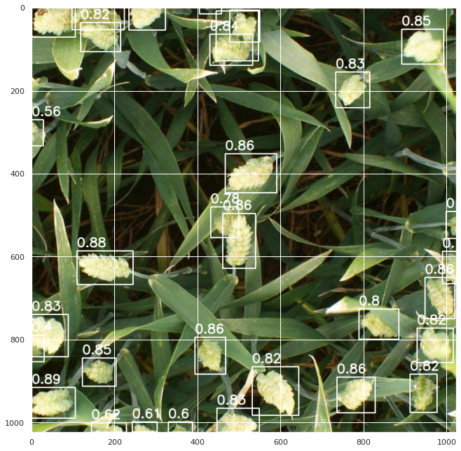

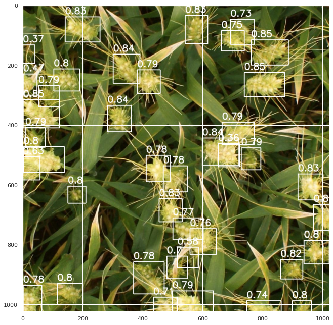

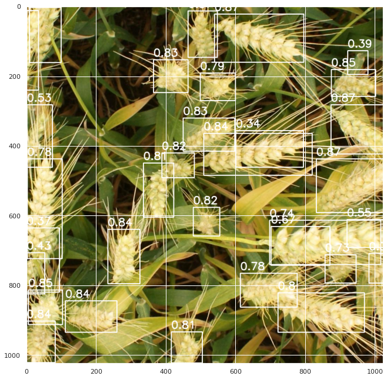

For more detail of Training YoloV4 with Global Wheat Detection and full code visit [here](https://github.com/DhruvMakwana/Global-Wheat-Detection/blob/master/training/YOLO/YOLOV4/Training_YOLOV4.ipynb)